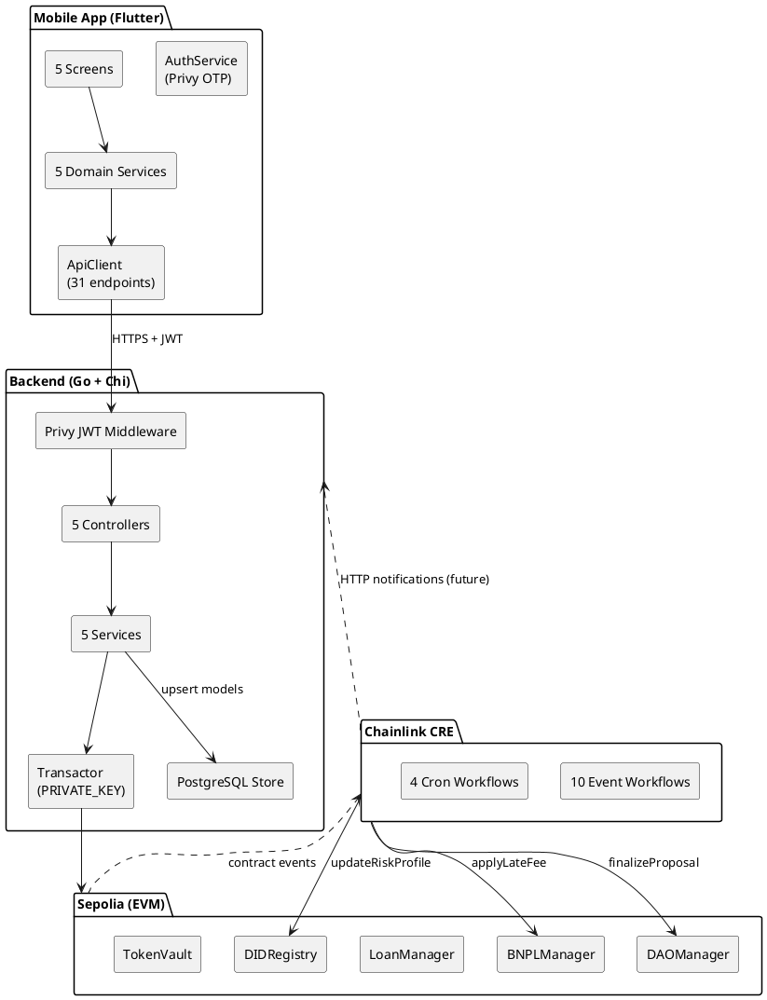
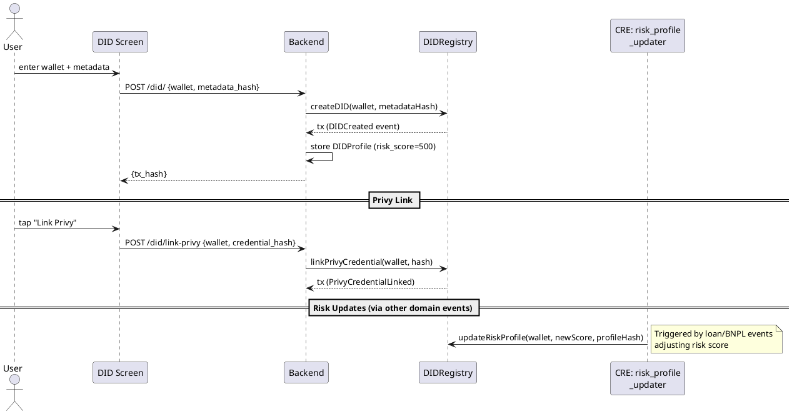
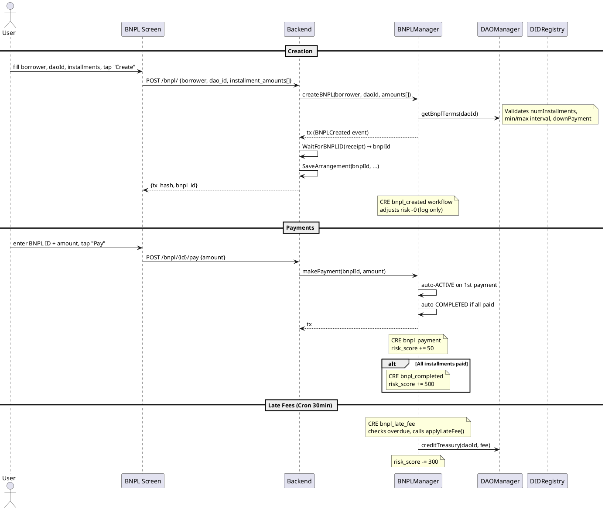
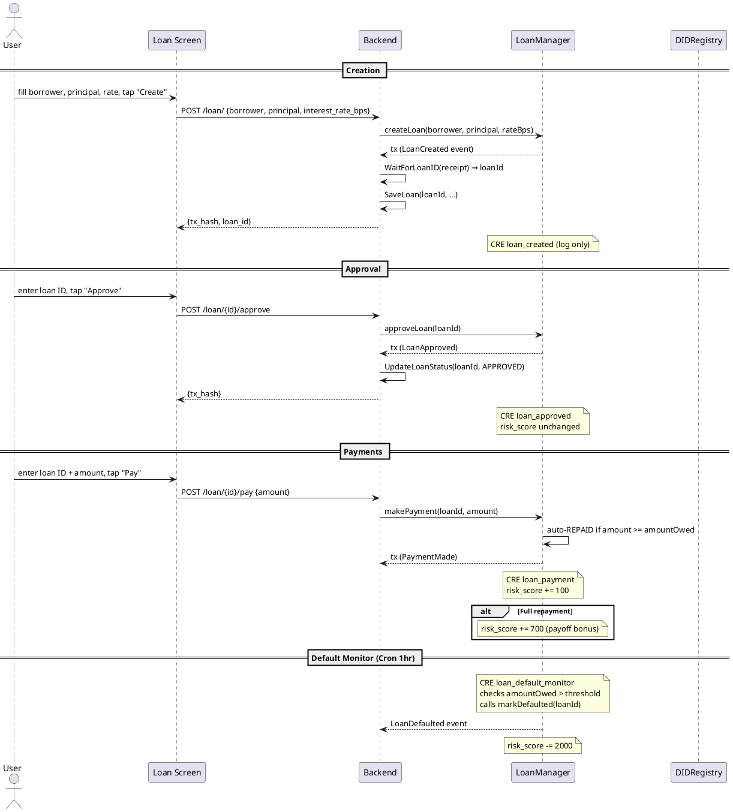
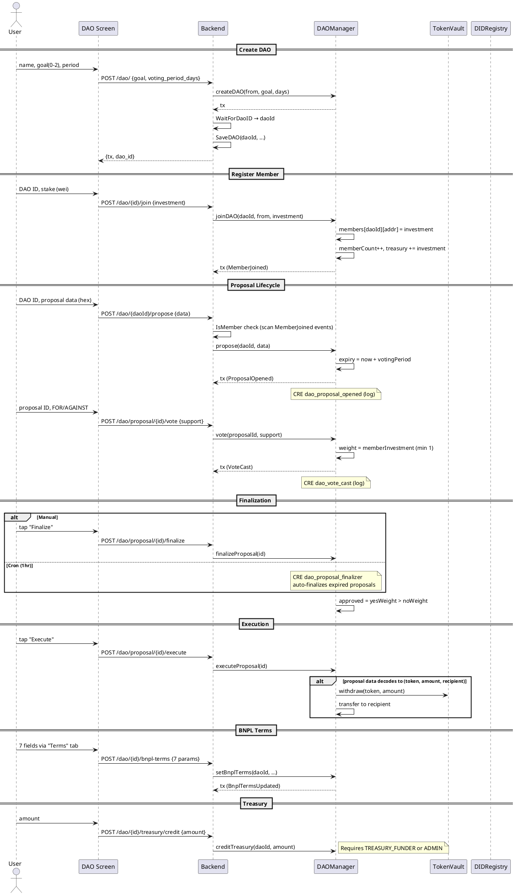
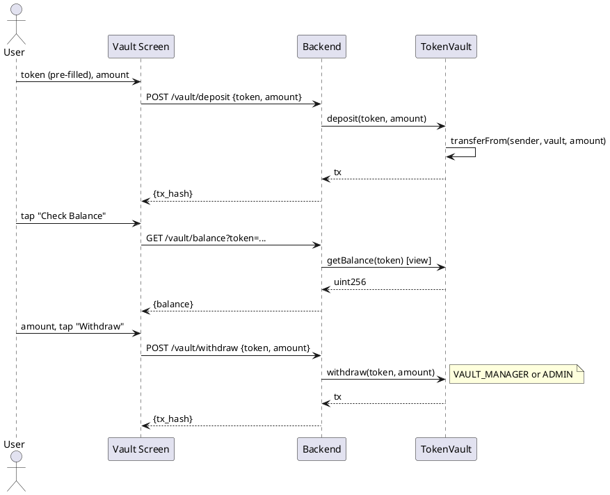
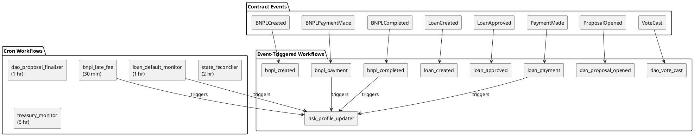
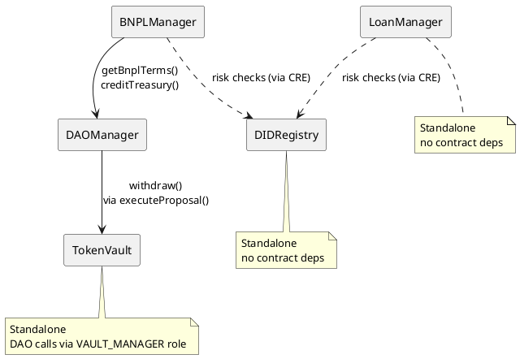
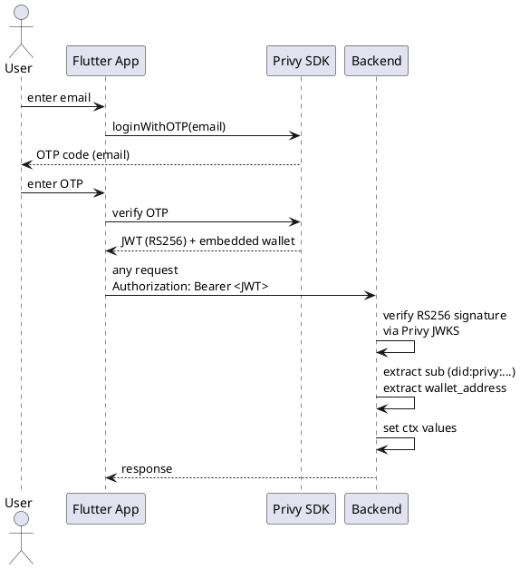
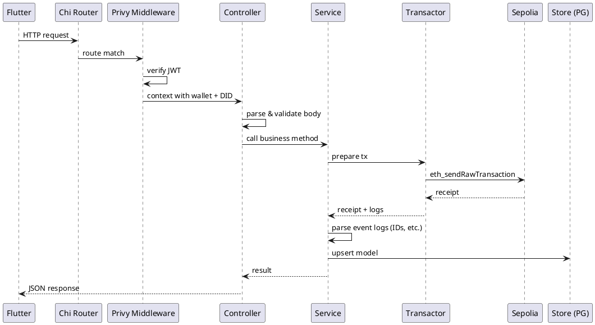

# Optimus Protocol — System Documentation

> Generated from the implemented codebase targeting **EVM / Sepolia** (chain 11155111).

## Documentation Index

| Layer | Path | Contents |
|-------|------|----------|
| Smart Contracts | [docs/contracts/](contracts/README.md) | 5 Solidity contracts with roles, storage, functions, events |
| Backend (Go) | [docs/protocol/](protocol/README.md) | Chi router, Privy JWT auth, 5 controller groups, PostgreSQL store |
| CRE Workflows | [docs/workflows/](workflows/README.md) | 14 Chainlink workflows (10 event-triggered, 4 cron) |
| Mobile App (Flutter) | [docs/client/](client/README.md) | 5 screens, API client (31 endpoints), Privy auth |

## Deployed Addresses (Sepolia)

| Contract | Address |
|----------|---------|
| DIDRegistry | `0x0E9D8959bCD99e7AFD7C693e51781058A998b756` |
| BNPLManager | `0x4d99Dc2e504c15496319339E822C4a8EAfe3e2ba` |
| LoanManager | `0xbB0D4067488edf4a007822407e2486412dC8D39D` |
| DAOManager | `0x561289A9B8439E3fb288a33b3c39C78E0923Cd2b` |
| TokenVault | `0x4C704D51fc47cfe582F8c5477de3AE398B344907` |
| Deployer | `0x08DEB6b37c3659D045a7Fb93C742f33D1f9B3780` |

## Architecture Overview

## End-to-End Data Flows

### 1. Identity (DID) Flow

### 2. BNPL Flow (Full Lifecycle)

### 3. Loan Flow (Full Lifecycle)

### 4. DAO Governance Flow

### 5. Token Vault Flow

## Risk Score System

All risk scores flow through `DIDRegistry.updateRiskProfile()` via CRE workflows.

| Event | Workflow | Score Δ |
|-------|----------|---------|
| BNPL payment made | `bnpl_payment` | **+50** |
| BNPL completed | `bnpl_completed` | **+500** |
| BNPL late fee applied | `bnpl_late_fee` | **−300** |
| Loan payment made | `loan_payment` | **+100** |
| Loan fully repaid | `loan_payment` | **+700** |
| Loan defaulted | `loan_default_monitor` | **−2000** |

Initial score: **500** (set on DID creation in backend store).

## Event → Workflow Mapping

## Contract Dependency Graph

## Authentication Flow

## Backend Request Lifecycle

