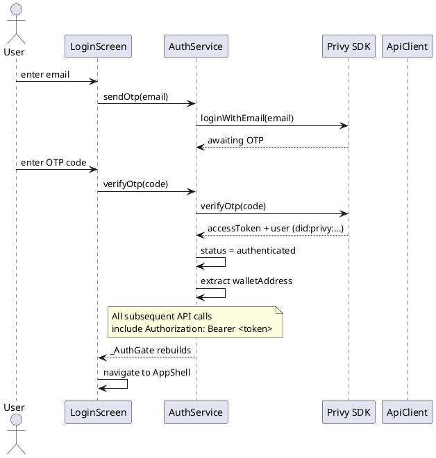

# Optimus Mobile App (Flutter)

**Source:** `client/prime/`  
**SDK:** Flutter 3.11+ / Dart  
**State:** Provider (ChangeNotifier)  
**Auth:** Privy Flutter SDK (`privy_flutter: ^0.6.0`)

## Architecture Overview

```
┌─────────────────────────────────────────────────┐
│                   Flutter App                    │
│                                                  │
│   ┌────────────────────────────────────────────┐ │
│   │              _AuthGate                     │ │
│   │   (routes to LoginScreen or AppShell)      │ │
│   └──────────┬─────────────────────────────────┘ │
│              │                                   │
│   ┌──────────▼─────────────────────────────────┐ │
│   │           AppShell (5-tab nav)              │ │
│   │  ┌────┬──────┬──────┬──────┬──────┐        │ │
│   │  │DID │ BNPL │ Loan │ DAO  │ Vault│        │ │
│   │  │Scr │ Scr  │ Scr  │ Scr  │ Scr  │        │ │
│   │  └──┬─┴────┬─┴────┬─┴────┬─┴────┬─┘        │ │
│   │     │      │      │      │      │           │ │
│   │  ┌──▼──┬───▼──┬───▼──┬───▼──┬───▼──┐       │ │
│   │  │DID  │BNPL  │Loan  │DAO   │Vault │       │ │
│   │  │Svc  │Svc   │Svc   │Svc   │Svc   │       │ │
│   │  └──┬──┴───┬──┴───┬──┴───┬──┴───┬──┘       │ │
│   │     └──────┴───┬──┴──────┴──────┘           │ │
│   │                │                             │ │
│   │          ┌─────▼─────┐                       │ │
│   │          │ ApiClient  │ (HTTP + JWT)          │ │
│   │          └─────┬─────┘                       │ │
│   │                │                             │ │
│   │          ┌─────▼─────┐                       │ │
│   │          │ AuthService│ (Privy SDK)           │ │
│   │          └───────────┘                       │ │
│   └──────────────────────────────────────────────┘ │
│                      │                             │
│            Bearer JWT │                             │
└──────────────────────┼─────────────────────────────┘
                       │
              ┌────────▼────────┐
              │  Go Backend API  │
              │  :8000           │
              └─────────────────┘
```

## File Structure

| File | Purpose |
|------|---------|
| `lib/main.dart` | Entry point, MultiProvider setup, _AuthGate |
| `lib/widgets/app_shell.dart` | 5-tab NavigationBar (Identity, BNPL, Loans, DAO, Vault) |
| `lib/screens/login_screen.dart` | Privy email/OTP login |
| `lib/screens/did_screen.dart` | DID identity management |
| `lib/screens/bnpl_screen.dart` | BNPL arrangement CRUD |
| `lib/screens/loan_screen.dart` | Loan management |
| `lib/screens/dao_screen.dart` | DAO governance (4 tabs) |
| `lib/screens/vault_screen.dart` | TokenVault operations |
| `lib/services/api_client.dart` | HTTP client with 32 endpoints |
| `lib/services/auth_service.dart` | Privy auth state management |
| `lib/services/did_service.dart` | DID business logic |
| `lib/services/bnpl_service.dart` | BNPL business logic |
| `lib/services/loan_service.dart` | Loan business logic |
| `lib/services/dao_service.dart` | DAO business logic |
| `lib/services/vault_service.dart` | Vault business logic |
| `lib/config.dart` | API base URL, contract addresses |
| `lib/theme.dart` | App theme/styling |
| `lib/widgets/shared.dart` | Reusable widgets (InfoCard, KVRow, etc.) |

## Auth Flow



## Screen → API Mapping

See detailed per-screen documentation:

- [DID Screen](screens/did.md)
- [BNPL Screen](screens/bnpl.md)
- [Loan Screen](screens/loan.md)
- [DAO Screen](screens/dao.md)
- [Vault Screen](screens/vault.md)

## Provider Architecture

All services extend `ChangeNotifier`:

| Service | Fields | Key Methods |
|---------|--------|-------------|
| `AuthService` | `status`, `walletAddress`, `accessToken` | `init()`, `sendOtp()`, `verifyOtp()`, `logout()` |
| `DIDService` | `profile`, `loading`, `error` | `createDID()`, `lookupDID()` |
| `BNPLService` | `current`, `loading`, `error`, `lastTx` | `createArrangement()`, `fetchArrangement()`, `makePayment(id, installment, amount)`, `reschedule()` |
| `LoanService` | `current`, `accruedInterest`, `amountOwed`, `loading`, `error`, `lastTx` | `createLoan()`, `fetchLoan()`, `approveLoan()`, `makePayment(id, amount)`, `fetchAccruedInterest()`, `fetchAmountOwed()` |
| `DAOService` | `currentDAO`, `bnplTerms`, `treasuryBalance`, `loading`, `error`, `lastTx` | `createDAO()`, `joinDAO()`, `propose()`, `proposeTreasuryWithdrawal()`, `vote()`, `finalizeProposal()`, `executeProposal()`, `setBnplTerms()`, `fetchBnplTerms()`, `fetchTreasuryBalance()`, `creditTreasury()` |
| `VaultService` | `balance`, `loading`, `error`, `lastTx` | `deposit()`, `withdraw()`, `fetchBalance()` |

### Key Changes from Initial Design

| Change | Reason |
|--------|--------|
| `DIDService` no longer has `linkPrivy()`, `fetchRiskScore()`, `updateRiskProfile()` | Privy is auto-linked during DID creation; risk scoring is managed exclusively by CRE workflows |
| `BNPLService` no longer has `activate()` or `applyLateFee()` | Activation happens automatically on first payment; late fees are applied by the `bnpl_late_fee` CRE cron workflow |
| `LoanService` no longer has `markDefaulted()` | Loan defaults are detected and applied by the `loan_default_monitor` CRE cron workflow |
| `makePayment()` on BNPL and Loan services now accepts an `amount` parameter | The ETH amount is sent as `msg.value` on the payable contract call |
| `DAOService` adds `proposeTreasuryWithdrawal()` | Structured proposal mode with token/amount/recipient fields that ABI-encode into calldata |
