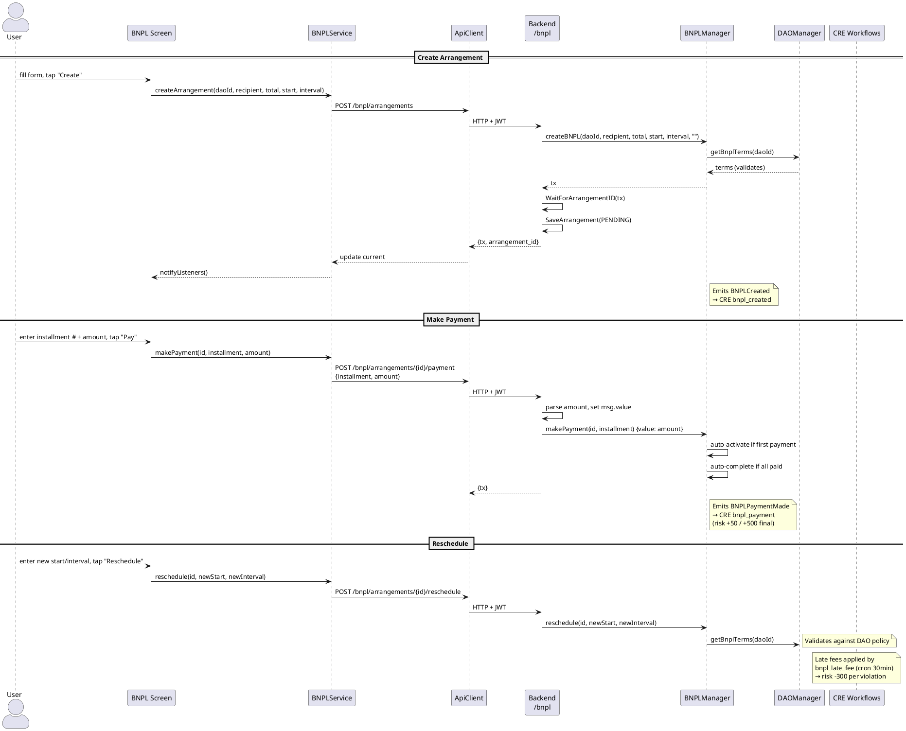

# BNPL Screen

**Source:** `client/prime/lib/screens/bnpl_screen.dart`  
**Service:** `BNPLService`  
**Tab:** BNPL (index 1)

## UI Elements

### Lookup Section
| Element | Controller | API Endpoint |
|---------|-----------|-------------|
| Arrangement ID | `_arrIdCtrl` | `GET /bnpl/arrangements/{id}` |
| Fetch | Button | Triggers fetch |

### Arrangement Detail (when loaded)
Displays: arrangementId, daoId, payer, recipient, totalAmount, numInstallments, startTimestamp, intervalSeconds, lateFeeBps, status

Status labels: `PENDING` (0), `ACTIVE` (1), `COMPLETED` (2)

### Payment Section
| Field | Controller | Purpose |
|-------|-----------|---------|
| Installment # | `_installmentCtrl` | Which installment to pay |
| Amount (wei) | `_payAmountCtrl` | ETH value to send with the payable call |
| Pay | Button | `POST /bnpl/arrangements/{id}/payment` |

### Reschedule Section
| Field | Controller | API Endpoint |
|-------|-----------|-------------|
| New Start (unix) | `_newStartCtrl` | `POST /bnpl/arrangements/{id}/reschedule` |
| New Interval (sec) | `_newIntervalCtrl` | (same endpoint) |

### Create Form (toggle)
| Field | Controller | API Endpoint |
|-------|-----------|-------------|
| DAO ID | `_daoIdCtrl` | `POST /bnpl/arrangements` |
| Recipient Address | `_recipientCtrl` | (same) — auto-filled from Privy wallet |
| Total Amount (wei) | `_totalCtrl` | (same) |
| Start Date (unix) | `_startCtrl` | (same) |
| Payment Interval (sec) | `_intervalCtrl` | (same) |

> **Removed** (not user-facing):
> - **Activate** button — Contract auto-activates on first payment. Manual activation is redundant.
> - **Late Fee** button — No access control on contract = griefable. Applied exclusively by `bnpl_late_fee` CRE cron workflow.

## Screen → API → Contract → Workflow Flow

