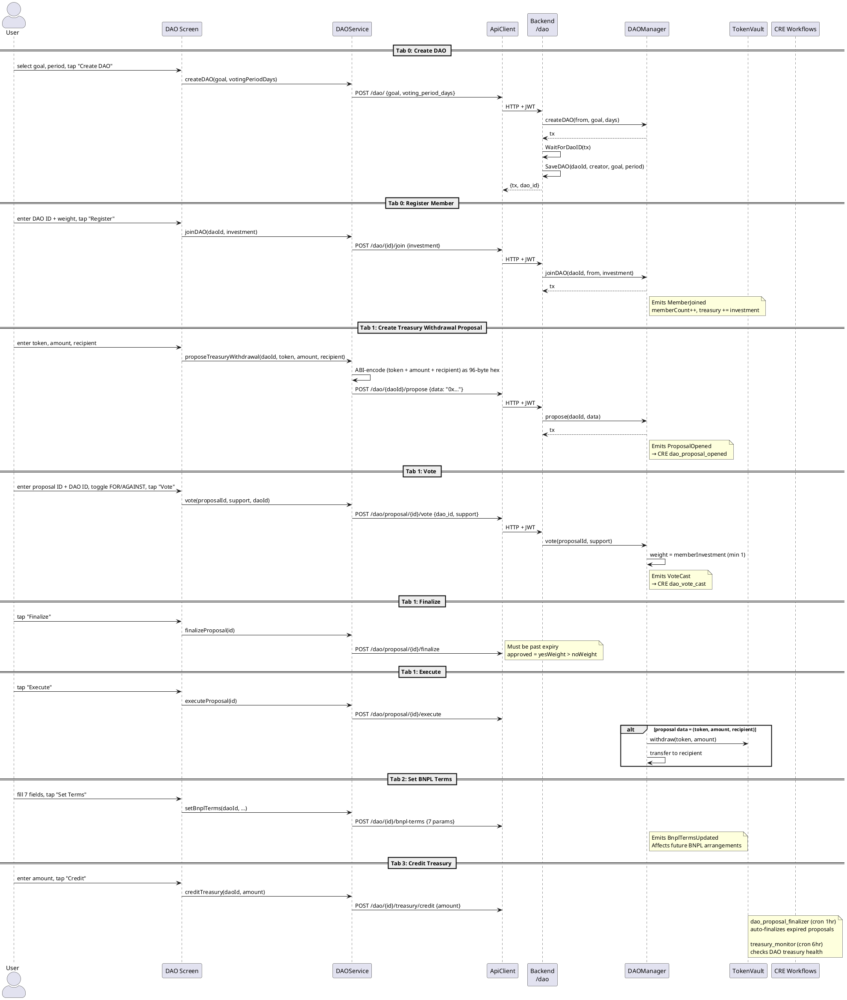

# DAO Screen

**Source:** `client/prime/lib/screens/dao_screen.dart`  
**Service:** `DAOService`  
**Tab:** DAO (index 3)  
**Layout:** 4-tab TabBarView

## Tab Structure

| Tab | Name | Functionality |
|-----|------|---------------|
| 0 | DAO | Create DAO + Register Member |
| 1 | Proposals | Propose, Vote, Finalize, Execute |
| 2 | Terms | View + Set BNPL Terms |
| 3 | Treasury | View Balance + Credit |

## Tab 0: DAO (Create & Join)

| Field | Controller | API Endpoint |
|-------|-----------|-------------|
| Goal | `_selectedGoal` dropdown | `POST /dao/` → `goal: 0/1/2` |
| Voting Period (days) | `_votingPeriodCtrl` | `POST /dao/` → `voting_period_days` |
| DAO ID (join) | `_joinDaoIdCtrl` | `POST /dao/{id}/join` |
| Voting Weight | `_investmentCtrl` | `POST /dao/{id}/join` → `investment` |

Goal dropdown options: Savings (0), Lending (1), Investment (2)

> **Removed:** DAO Name field — The contract has no name field; it uses the goal enum.

## Tab 1: Proposals

The proposal tab supports two modes: **structured** (treasury withdrawal) and **raw hex** (generic proposals).

### Structured Mode (default)
| Field | Controller | Purpose |
|-------|-----------|---------|
| DAO ID | `_proposeDaoIdCtrl` | Target DAO for the proposal |
| Token Address | `_propTokenCtrl` | ERC-20 token to withdraw |
| Amount (wei) | `_propAmountCtrl` | Amount to withdraw |
| Recipient (0x…) | `_propRecipientCtrl` | Who receives the tokens |

The service builds `abi.encode(address token, uint256 amount, address recipient)` as the proposal data (3×32-byte hex-encoded values).

### Raw Mode (toggle)
| Field | Controller | Purpose |
|-------|-----------|---------|
| Proposal Data (hex) | `_propRawDataCtrl` | Arbitrary proposal payload |
| Raw Data toggle | `_useRawProposal` SwitchListTile | Switches between structured and raw mode |

### Vote
| Field | Controller | API Endpoint |
|-------|-----------|-------------|
| Proposal ID | `_voteProposalIdCtrl` | `POST /dao/proposal/{id}/vote` |
| DAO ID | `_voteDaoIdCtrl` | (same) → `dao_id` — **required** with validation |
| Support toggle | `_voteSupport` | (same) → `support: bool` |

### Finalize / Execute
| Field | Controller | API Endpoint |
|-------|-----------|-------------|
| Proposal ID | `_actionProposalIdCtrl` | `POST /dao/proposal/{id}/finalize` or `execute` |

> **Changed:** Vote DAO ID is now **required** (with validation). Previously was labeled "(optional)".
> **Changed:** "Initial Stake (wei)" → **"Voting Weight (accounting units)"** with clarifying hint.

## Tab 2: BNPL Terms

| Field | Controller | API Endpoint |
|-------|-----------|-------------|
| DAO ID | `_termsDaoIdCtrl` | `GET /dao/{id}/bnpl-terms` |
| Num Installments | `_numInstCtrl` | `POST /dao/{id}/bnpl-terms` |
| Min Days | `_minDaysCtrl` | (same) |
| Max Days | `_maxDaysCtrl` | (same) |
| Late Fee (bps) | `_lateFeeBpsCtrl` | (same) |
| Grace Days | `_graceDaysCtrl` | (same) |
| Min Down Payment (bps) | `_minDownBpsCtrl` | (same) |
| Reschedule Allowed | `_rescheduleAllowed` switch | (same) |

## Tab 3: Treasury

| Field | Controller | API Endpoint |
|-------|-----------|-------------|
| DAO ID | `_treasuryDaoIdCtrl` | `GET /dao/{id}/treasury` |
| Amount (wei) | `_creditAmountCtrl` | `POST /dao/{id}/treasury/credit` |

## Full DAO Flow Diagram

