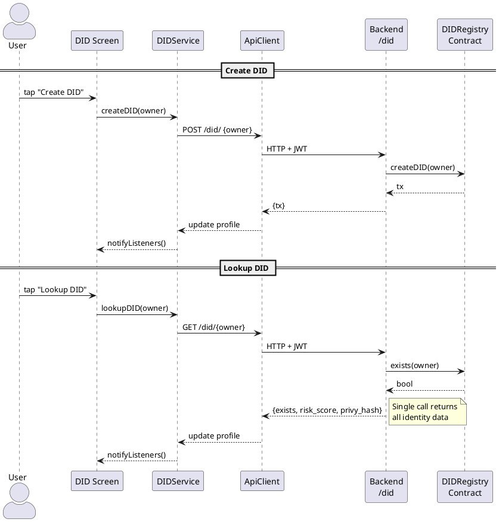

# DID Screen

**Source:** `client/prime/lib/screens/did_screen.dart`  
**Service:** `DIDService`  
**Tab:** Identity (index 0)

## UI Elements

| UI Element | Field/Controller | Purpose |
|-----------|-----------------|---------|
| Owner Address | `_ownerCtrl` | Wallet address — auto-filled from Privy |
| Create DID | Button | Send `POST /did/` |
| Lookup DID | Button | Send `GET /did/{owner}` — fetches existence, risk score, Privy hash |

> **Removed** (not user-facing):
> - **Update Risk Profile** — Restricted to `RISK_UPDATER_ROLE`; managed exclusively by CRE workflows.
> - **Link Privy / Fetch Privy Hash** — Privy credential is auto-linked by `AuthService` on login.
> - **Fetch Risk Score** (separate button) — `lookupDID` already returns the full profile including risk score.

## DID Profile Display

When a DID is looked up, the following fields are displayed:

| Field | Source |
|-------|--------|
| Owner | DID profile |
| Registered | `exists` boolean |
| Risk Score | On-chain `getRiskProfileScore` |
| Risk Tier | Computed client-side (EXCELLENT ≥ 800, GOOD ≥ 600, FAIR ≥ 400, POOR < 400) |
| Privy Hash | On-chain `getPrivyCredentialHash` (if set) |

## Screen → API → Contract Flow

## Auto-fill Behavior

The owner address field is automatically populated with the authenticated Privy wallet address on first build (controlled by `_prefilled` flag).

## Identity Notes

- **Privy credential** is automatically linked by `AuthService` on login — no manual linking required.
- **Risk score** is updated by CRE workflows (`bnpl_payment`, `bnpl_late_fee`, `loan_payment`, `loan_default_monitor`) based on BNPL and loan activity. Users cannot modify their own risk score.
