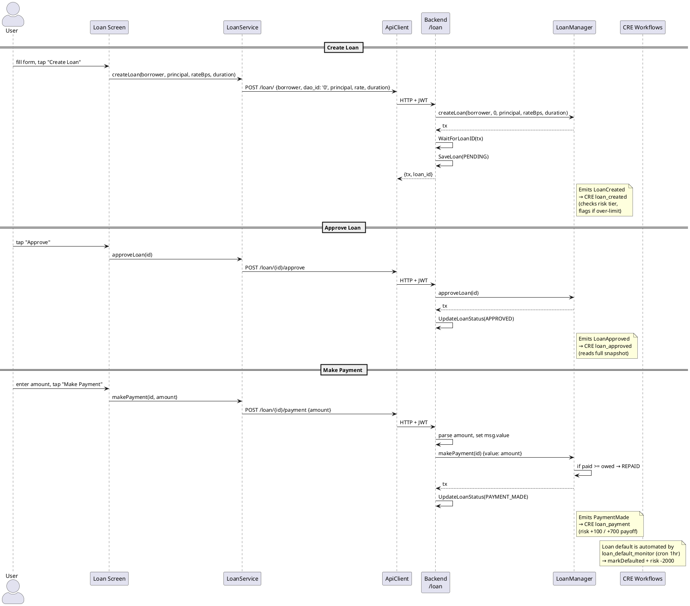

# Loan Screen

**Source:** `client/prime/lib/screens/loan_screen.dart`  
**Service:** `LoanService`  
**Tab:** Loans (index 2)

## UI Elements

### Lookup Section
| Element | Controller | API Endpoint |
|---------|-----------|-------------|
| Loan ID | `_idCtrl` | `GET /loan/{id}` + interest + owed |

### Loan Detail (when loaded)
Displays: loanId, borrower, principal (wei + ETH), interestRate %, start, end, amountPaid, status, accruedInterest, totalOwed

Status labels: `PENDING` (0), `APPROVED` (1), `REPAID` (2), `DEFAULTED` (3)

### Action Buttons
| Button | API Endpoint | Notes |
|--------|-------------|-------|
| Approve | `POST /loan/{id}/approve` | Changes status to APPROVED |
| Make Payment | `POST /loan/{id}/payment` | Sends ETH amount; auto-marks REPAID when owed=0 |
| Refresh Amounts | `GET /loan/{id}/interest` + `GET /loan/{id}/owed` | Updates display |

### Payment Section
| Field | Controller | Purpose |
|-------|-----------|---------|
| Amount (wei) | `_payAmountCtrl` | ETH value to send with the payable `makePayment` call |

### Create Form (toggle)
| Field | Controller | API Endpoint |
|-------|-----------|-------------|
| Borrower (0x…) | `_borrowerCtrl` | `POST /loan/` — auto-filled from Privy wallet |
| Principal (wei) | `_principalCtrl` | (same) |
| Interest Rate (bps) | `_rateBpsCtrl` | (same) |
| Duration (seconds) | `_durationCtrl` | (same) |

> **Removed** (not user-facing):
> - **DAO ID** field — Contract's second parameter is unused (reserved for future DAO-linked features). The API hardcodes `dao_id: '0'`.
> - **Mark Defaulted** button — No access control on the contract = griefable. Handled exclusively by `loan_default_monitor` CRE cron workflow.

**Note:** Borrower field is auto-filled from Privy wallet address.

## Screen → API → Contract → Workflow Flow

