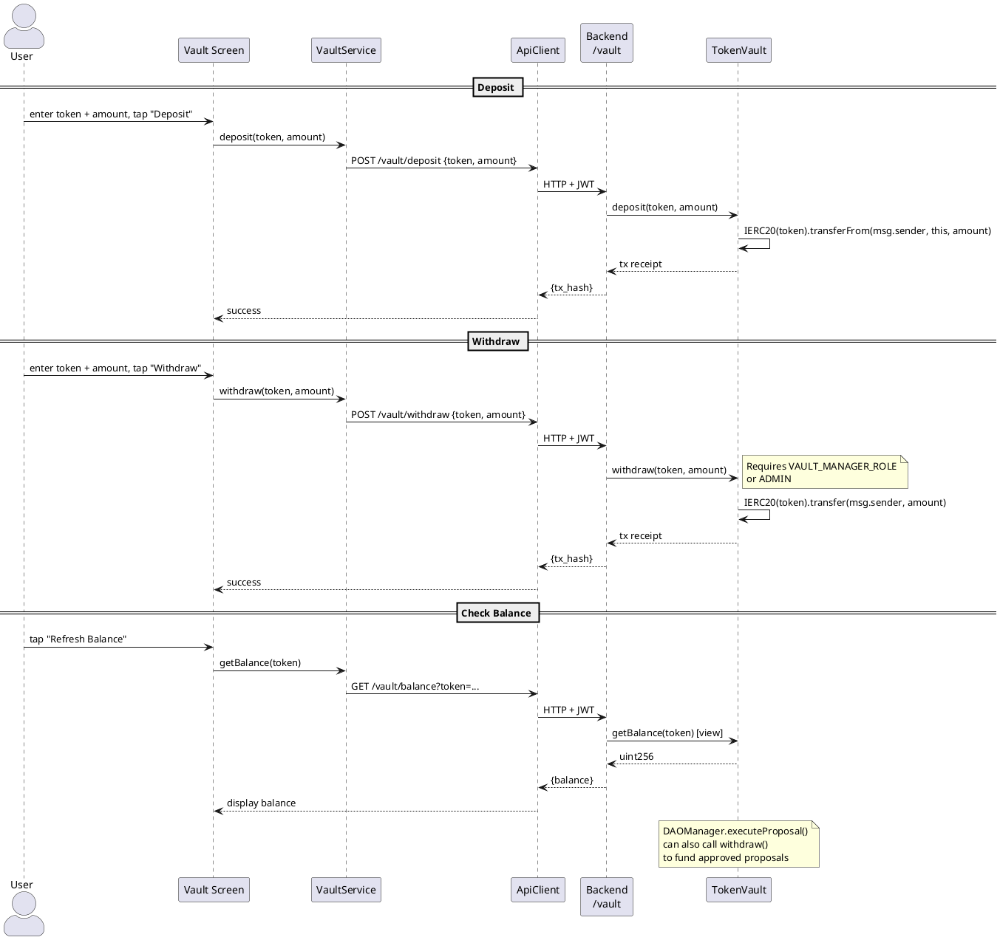

# Token Vault Screen

**Source:** `client/prime/lib/screens/vault_screen.dart`  
**Service:** `VaultService`  
**Tab:** Vault (index 4)

## UI Elements

| Field | Controller | API Endpoint |
|-------|-----------|-------------|
| ERC-20 Token Address | `_tokenCtrl` | All 3 endpoints |
| Amount (wei) | `_amountCtrl` | `POST /vault/deposit`, `POST /vault/withdraw` |
| Balance Display | read-only | `GET /vault/balance?token=` |

> **Changed:** Token field no longer pre-fills with `AppConfig.tokenVaultAddress` (which was incorrectly filling the vault contract address instead of an ERC-20 token address). Users must enter the specific ERC-20 token contract address they wish to deposit or withdraw.

## Actions

| Button | Method | API Call |
|--------|--------|----------|
| Deposit | `_deposit()` | `POST /vault/deposit {token, amount}` |
| Withdraw | `_withdraw()` | `POST /vault/withdraw {token, amount}` |
| Refresh Balance | `_checkBalance()` | `GET /vault/balance?token=` |

## Data Flow Diagram

