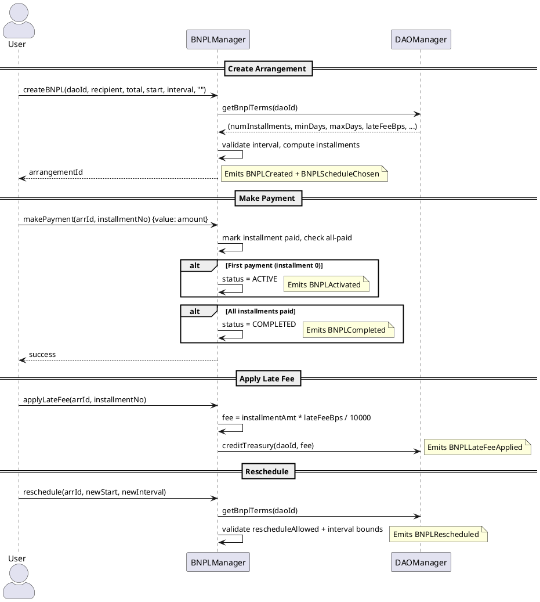

# BNPLManager Contract

**Source:** `contracts/src/BNPLManager.sol`  
**Interface:** `contracts/src/interfaces/IBNPLManager.sol`  
**Address:** `0x4d99Dc2e504c15496319339E822C4a8EAfe3e2ba`

## Purpose

BNPL (Buy-Now-Pay-Later) installment arrangement manager. Users create arrangements tied to a DAO and pay in installments. The number of installments, late fee basis points, and interval constraints are governed by the DAO's BNPL terms configuration.

## Dependencies

- **DAOManager** — reads BNPL terms (`getBnplTerms`), credits treasury on late fees (`creditTreasury`)
- Set via `setDaoManager(address)` (admin-only)

## Roles (AccessControl)

| Role                | Purpose                                  |
|---------------------|------------------------------------------|
| `DEFAULT_ADMIN_ROLE`| Admin — can set DAO manager, reschedule  |
| `BNPL_ADMIN_ROLE`   | Reserved for future admin operations     |

## Storage

```solidity
struct Arrangement {
    uint256 id;
    uint256 daoId;
    address payer;
    address recipient;
    uint256 totalAmount;
    uint256 numInstallments;        // from DAO BNPL terms
    uint256[] installmentAmounts;   // computed at creation
    uint256 startTimestamp;
    uint256 intervalSeconds;
    uint256 lateFeeBps;             // from DAO BNPL terms
    uint8 status;                   // 0=PENDING, 1=ACTIVE, 2=COMPLETED
    mapping(uint256 => bool) installmentPaid;
}
```

## Status Lifecycle

```
PENDING (0) ──► ACTIVE (1) ──► COMPLETED (2)
    │                │
    │  first payment │  all installments
    │  activates     │  paid
    └────────────────┘
```

## Functions

### Write Functions

| Function | Params | Access | Description |
|----------|--------|--------|-------------|
| `createBNPL(daoId, recipient, totalAmount, startTimestamp, intervalSeconds, metadata)` | see params | any | Creates arrangement. Reads terms from DAOManager. Validates interval against DAO min/max days. Splits total into N installments. |
| `makePayment(arrangementId, installmentNumber)` | `uint256, uint8` | any (payable) | Pays a specific installment. Requires `msg.value >= installmentAmount`. Auto-activates on first payment. Auto-completes when all paid. |
| `activateBNPL(arrangementId)` | `uint256` | any | Manually activate (requires first payment already made). |
| `applyLateFee(arrangementId, installmentNumber)` | `uint256, uint8` | any | Applies late fee (bps from terms). Credits fee to DAO treasury. |
| `reschedule(arrangementId, newStart, newInterval)` | `uint256, uint256, uint256` | payer or ADMIN | Changes schedule. Requires DAO `rescheduleAllowed=true`. Validates new interval against DAO bounds. |

### Read Functions

| Function | Returns | Description |
|----------|---------|-------------|
| `getArrangement(id)` | full struct tuple | Returns all arrangement fields |

## Events (consumed by CRE workflows)

| Event | Trigger | CRE Workflow |
|-------|---------|--------------|
| `BNPLCreated(arrangementId, daoId, payer, recipient, totalAmount, numInstallments, createdAt)` | `createBNPL` | `bnpl_created` |
| `BNPLPaymentMade(arrangementId, installmentNumber, payer, amount, timestamp)` | `makePayment` | `bnpl_payment` |
| `BNPLActivated(arrangementId, activatedAt)` | first payment / `activateBNPL` | — |
| `BNPLLateFeeApplied(arrangementId, installmentNumber, feeAmount, timestamp)` | `applyLateFee` | Detected by `bnpl_late_fee` (cron) |
| `BNPLRescheduled(arrangementId, oldHash, newHash, timestamp)` | `reschedule` | — |
| `BNPLCompleted(arrangementId, completedAt)` | all paid | `bnpl_completed` |

## Flow Diagram


