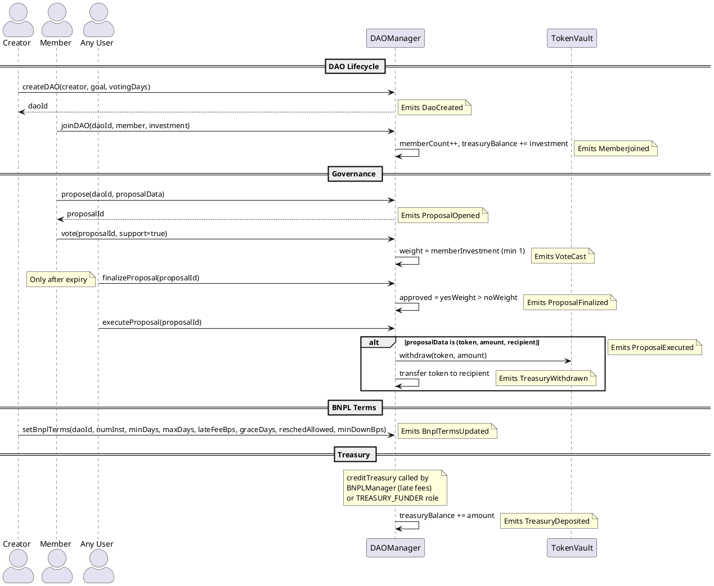

# DAOManager Contract

**Source:** `contracts/src/DAOManager.sol`  
**Interface:** `contracts/src/interfaces/IDAOManager.sol`  
**Address:** `0x561289A9B8439E3fb288a33b3c39C78E0923Cd2b`

## Purpose

Full DAO governance contract managing membership, governance proposals (vote/finalize/execute), BNPL terms configuration, and treasury accounting. This is the most complex contract in the system — it provides the policy layer for BNPLManager's installment terms and acts as a treasury accounting ledger.

## Dependencies

- **TokenVault** — used by `executeProposal()` to withdraw ERC-20 tokens for approved proposals
- Set via `setTokenVault(address)` (admin-only)

## Roles (AccessControl)

| Role                   | Purpose                                        |
|------------------------|------------------------------------------------|
| `DEFAULT_ADMIN_ROLE`   | Admin — setTokenVault, creditTreasury           |
| `DAO_ADMIN_ROLE`       | Reserved for future DAO admin operations        |
| `TREASURY_FUNDER_ROLE` | Can call `creditTreasury()` (e.g. BNPLManager)  |

## Storage

```solidity
struct Dao {
    address creator;
    uint8   goal;                // 0=SAVINGS, 1=LENDING, 2=INVESTMENT
    uint64  votingPeriodDays;
    uint256 treasuryBalance;     // accounting balance (not actual ETH/tokens)
    uint256 memberCount;
    uint256 createdAt;
    bool    isDissolved;
    uint256 quorumBps;
}

struct Proposal {
    uint256 daoId;
    bytes   data;                // encoded proposal payload
    uint256 expiry;              // votingPeriodDays after creation
    uint256 yesWeight;
    uint256 noWeight;
    bool    finalized;
    bool    executed;
}

struct BnplTerms {
    uint256 numInstallments;
    uint256 allowedIntervalMinDays;
    uint256 allowedIntervalMaxDays;
    uint256 lateFeeBps;
    uint256 gracePeriodDays;
    bool    rescheduleAllowed;
    uint256 minDownPaymentBps;
}
```

## Functions

### DAO Lifecycle

| Function | Params | Access | Description |
|----------|--------|--------|-------------|
| `createDAO(creator, goal, votingPeriodDays)` | `address, uint8, uint64` | any | Creates a DAO and returns `daoId`. |
| `joinDAO(daoId, member, investmentAmount)` | `uint256, address, uint256` | any | Registers a member, increments member count and treasury. |

### Governance

| Function | Params | Access | Description |
|----------|--------|--------|-------------|
| `propose(daoId, proposalData)` | `uint256, bytes` | any | Creates a proposal with expiry = now + votingPeriodDays. |
| `vote(proposalId, support)` | `uint256, bool` | any (once per address) | Weighted vote. Weight = member's investment (min 1). |
| `finalizeProposal(proposalId)` | `uint256` | any (after expiry) | Marks as finalized. Approved if yesWeight > noWeight. |
| `executeProposal(proposalId)` | `uint256` | any | Executes an approved proposal. If data is exactly 96 bytes, decodes as (token, amount, recipient) for treasury withdrawal via TokenVault. |

### BNPL Terms Policy

| Function | Params | Description |
|----------|--------|-------------|
| `setBnplTerms(daoId, ...)` | 7 parameters | Configures BNPL installment rules for this DAO. |
| `getBnplTerms(daoId)` | `uint256` | Returns the 7-field terms struct. |

### Treasury

| Function | Params | Access | Description |
|----------|--------|--------|-------------|
| `creditTreasury(daoId, amount)` | `uint256, uint256` | TREASURY_FUNDER or ADMIN | Increases the accounting balance. Called by BNPLManager on late fees. |
| `getTreasuryBalance(daoId)` | `uint256` | any | Returns the current balance. |

## Events (consumed by CRE workflows)

| Event | Trigger | CRE Workflow |
|-------|---------|--------------|
| `DaoCreated(daoId, creator, goal, createdAt)` | `createDAO` | — |
| `MemberJoined(daoId, member, investment, joinedAt)` | `joinDAO` | — |
| `ProposalOpened(proposalId, daoId, expiry, data)` | `propose` | `dao_proposal_opened` |
| `VoteCast(proposalId, voter, support, weight)` | `vote` | `dao_vote_cast` |
| `ProposalFinalized(proposalId, approved, finalizedAt)` | `finalizeProposal` | — |
| `ProposalExecuted(proposalId, executedAt)` | `executeProposal` | — |
| `BnplTermsUpdated(daoId, ...)` | `setBnplTerms` | — |
| `TreasuryDeposited(daoId, by, amount, newBalance)` | `creditTreasury` | `treasury_monitor` (cron) |
| `TreasuryWithdrawn(daoId, to, token, amount)` | `executeProposal` (with encoded data) | `treasury_monitor` (cron) |

## Flow Diagram


