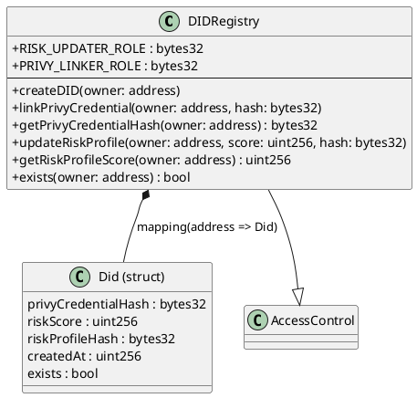

# DIDRegistry Contract

**Source:** `contracts/src/DIDRegistry.sol`  
**Interface:** `contracts/src/interfaces/IDIDRegistry.sol`  
**Address:** `0x0E9D8959bCD99e7AFD7C693e51781058A998b756`

## Purpose

On-chain DID (Decentralized Identity) registry that stores hashed Privy credential handles and a canonical risk score per address. It acts as the identity anchor for the entire protocol — every user must have a DID before using BNPL, loans, or DAO features.

## Roles (AccessControl)

| Role                | Purpose                                          |
|---------------------|--------------------------------------------------|
| `DEFAULT_ADMIN_ROLE`| Admin — can create DIDs for others, update scores |
| `PRIVY_LINKER_ROLE` | Can call `linkPrivyCredential()` on behalf of users |
| `RISK_UPDATER_ROLE` | Can call `updateRiskProfile()` — used by CRE workflows |

## Storage

```solidity
struct Did {
    bytes32 privyCredentialHash;  // keccak256 of Privy user ID
    uint256 riskScore;            // 0..10000
    bytes32 riskProfileHash;      // off-chain profile pointer
    uint256 createdAt;
    bool    exists;
}
mapping(address => Did) private _dids;
```

## Functions

### Write Functions

| Function                  | Params                                      | Access                    | Description |
|---------------------------|---------------------------------------------|---------------------------|-------------|
| `createDID(owner)`        | `address owner`                              | owner or ADMIN            | Creates a DID record. Reverts if already exists. |
| `linkPrivyCredential(owner, hash)` | `address owner, bytes32 privyCredentialHash` | owner, PRIVY_LINKER, or ADMIN | Stores hashed Privy credential pointer. |
| `updateRiskProfile(owner, score, hash)` | `address owner, uint256 newScore, bytes32 riskProfileHash` | RISK_UPDATER or ADMIN | Updates risk score (max 10000). |

### Read Functions

| Function                   | Returns              | Description |
|----------------------------|----------------------|-------------|
| `getPrivyCredentialHash(owner)` | `bytes32`       | Returns stored Privy hash (zero if unset). |
| `getRiskProfileScore(owner)` | `uint256`          | Returns the risk score. |
| `exists(owner)`            | `bool`               | Whether a DID exists for this address. |

## Events (consumed by CRE workflows)

| Event                        | Indexed Fields              | Usage |
|------------------------------|------------------------------|-------|
| `DIDCreated(owner, createdAt)` | `owner`                    | Triggers downstream identity setup |
| `PrivyCredentialLinked(owner, credentialHash, linkedAt)` | `owner`, `credentialHash` | Records Privy linkage on-chain |
| `RiskProfileUpdated(owner, newScore, profileHash)` | `owner`, `profileHash` | Triggers `risk_profile_updater` CRE workflow |

## Class Diagram


