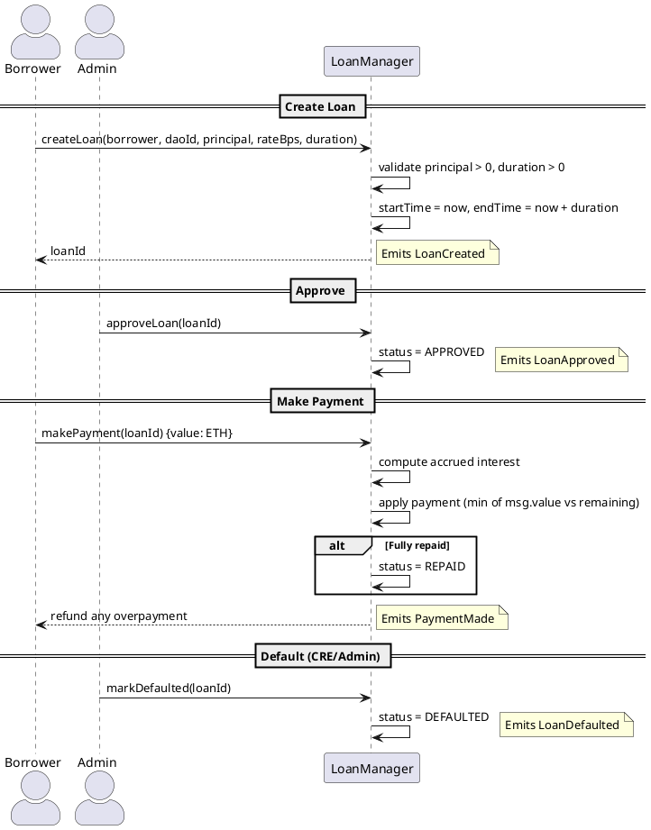

# LoanManager Contract

**Source:** `contracts/src/LoanManager.sol`  
**Interface:** `contracts/src/interfaces/ILoanManager.sol`  
**Address:** `0xbB0D4067488edf4a007822407e2486412dC8D39D`

## Purpose

Traditional loan lifecycle management with simple annual interest calculation. Loans go through PENDING → APPROVED → REPAID/DEFAULTED statuses.

## Roles (AccessControl)

| Role                | Purpose                              |
|---------------------|--------------------------------------|
| `DEFAULT_ADMIN_ROLE`| Admin — general management            |
| `LOAN_ADMIN_ROLE`   | Reserved for future admin operations  |

## Storage

```solidity
struct Loan {
    uint256 id;
    address borrower;
    uint256 principal;
    uint256 interestRateBps;   // annual rate in basis points
    uint256 startTime;
    uint256 endTime;
    uint256 amountPaid;
    uint8 status;              // 0=PENDING, 1=APPROVED, 2=REPAID, 3=DEFAULTED
}
```

## Status Lifecycle

```
PENDING (0) ──► APPROVED (1) ──► REPAID (2)
                     │
                     └──► DEFAULTED (3)
```

## Interest Calculation

Simple pro-rata annual interest:
```
accrued = (principal × interestRateBps × elapsedSeconds) / (10000 × 365 days)
amountOwed = principal + accrued - amountPaid
```

## Functions

### Write Functions

| Function | Params | Access | Description |
|----------|--------|--------|-------------|
| `createLoan(borrower, daoId, principal, interestRateBps, durationSeconds)` | see params | any | Creates a loan. `daoId` is passed but not used in storage (for future DAO-linked features). Sets `endTime = now + duration`. |
| `approveLoan(loanId)` | `uint256` | any | Sets status to APPROVED. No authorization check beyond existence. |
| `makePayment(loanId)` | `uint256` (payable) | any | Accepts ETH payment. Applies up to remaining owed. Auto-marks REPAID if fully paid. Refunds overpayment. |
| `markDefaulted(loanId)` | `uint256` | any | Sets status to DEFAULTED. **No access control** — intended for admin/CRE usage. |

### Read Functions

| Function | Returns | Description |
|----------|---------|-------------|
| `getLoan(loanId)` | full struct tuple | All loan fields |
| `getAccruedInterest(loanId)` | `uint256` | Current accrued interest |
| `getAmountOwed(loanId)` | `uint256` | principal + interest - paid |

## Events (consumed by CRE workflows)

| Event | Trigger | CRE Workflow |
|-------|---------|--------------|
| `LoanCreated(loanId, borrower, principal, interestRateBps, startTime, endTime)` | `createLoan` | `loan_created` |
| `LoanApproved(loanId, approver)` | `approveLoan` | `loan_approved` |
| `PaymentMade(loanId, payer, amount, amountPaid, remaining)` | `makePayment` | `loan_payment` |
| `LoanDefaulted(loanId)` | `markDefaulted` | — (downstream notification) |

## Flow Diagram


