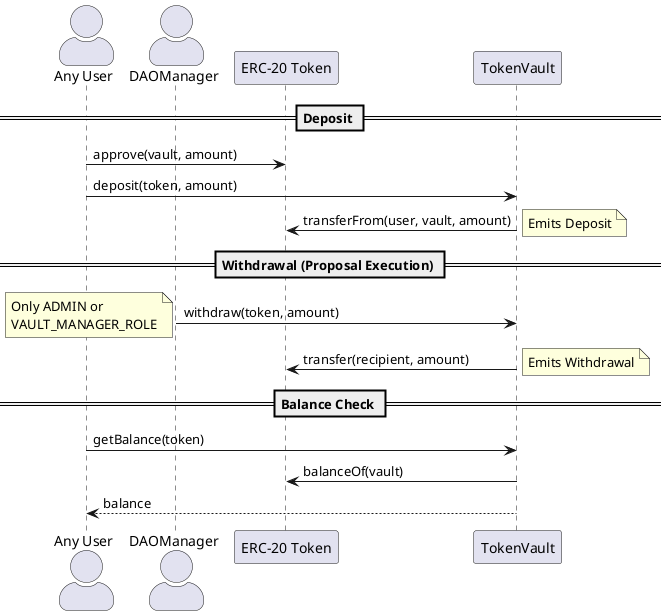

# TokenVault Contract

**Source:** `contracts/src/TokenVault.sol`  
**Interface:** `contracts/src/interfaces/ITokenVault.sol`  
**Address:** `0x4C704D51fc47cfe582F8c5477de3AE398B344907`

## Purpose

Simple ERC-20 token custodian. Accepts deposits from any address and restricts withdrawals to admin/vault-manager roles. Used by DAOManager's `executeProposal()` to disburse funds from approved proposals.

## Roles (AccessControl)

| Role                 | Purpose                               |
|----------------------|---------------------------------------|
| `DEFAULT_ADMIN_ROLE` | Full admin — can withdraw tokens      |
| `VAULT_MANAGER_ROLE` | Can call `withdraw()` (DAOManager)    |

## Functions

| Function | Type | Params | Access | Description |
|----------|------|--------|--------|-------------|
| `deposit(token, amount)` | write | `address, uint256` | any | Calls `transferFrom(msg.sender, this, amount)`. Requires token approval. |
| `withdraw(token, amount)` | write | `address, uint256` | ADMIN or VAULT_MANAGER | Transfers tokens out. Called by DAOManager during `executeProposal`. |
| `getBalance(token)` | read | `address` | any | Returns `IERC20(token).balanceOf(this)`. |

## Events

| Event | Trigger |
|-------|---------|
| `Deposit(token, depositor, amount)` | `deposit()` |
| `Withdrawal(token, amount)` | `withdraw()` |

## Flow Diagram

