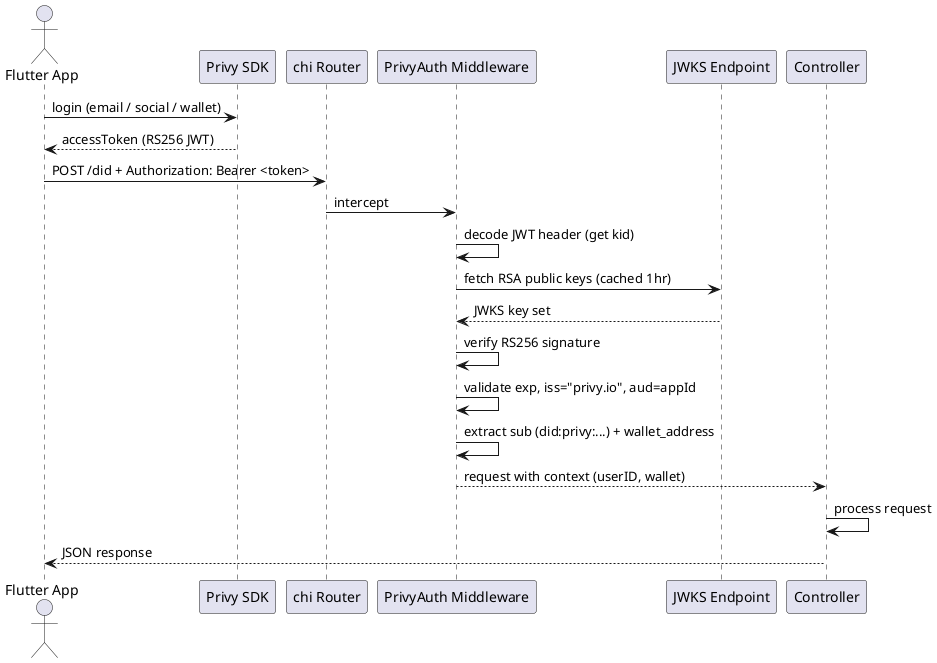
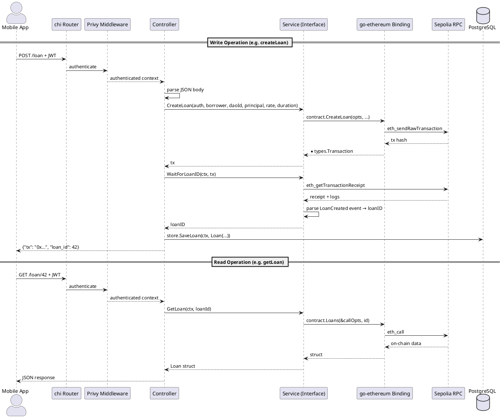

# Optimus Backend (Go Protocol Server)

**Source:** `protocol/`  
**Language:** Go 1.23+ (go-ethereum, chi, pgxpool)  
**Server:** `ubuntu@13.60.166.148` (EC2)

## Architecture Overview

The backend follows a **Controller → Service → Contract** layered architecture with clear dependency inversion:

```
┌─────────────────────────────────────────────────────┐
│                    HTTP Layer                        │
│   chi Router + Privy JWT Middleware                  │
├─────────┬──────────┬──────────┬──────────┬──────────┤
│ DID     │ BNPL     │ DAO      │ Loan     │ Vault    │
│ Ctrl    │ Ctrl     │ Ctrl     │ Ctrl     │ Ctrl     │
├─────────┼──────────┼──────────┼──────────┼──────────┤
│ IDid    │ IBNPL    │ IDAO     │ ILoan    │ IVault   │
│ Svc     │ Svc      │ Svc      │ Svc      │ Svc      │
├─────────┴──────────┴──────────┴──────────┴──────────┤
│     go-ethereum bindings → Sepolia (chain 11155111)  │
├─────────────────────────────────────────────────────┤
│     PostgreSQL (pgxpool) — off-chain Store           │
└─────────────────────────────────────────────────────┘
```

## Key Components

| Component         | Path                      | Purpose                              |
|-------------------|---------------------------|--------------------------------------|
| Entry point       | `main.go`                 | Wires dependencies, starts server    |
| Config            | `config.go`               | Reads env vars                       |
| Controllers (5)   | `controllers/{module}/`   | HTTP handlers, request parsing       |
| Services (5)      | `services/{module}/`      | Business logic, contract interactions|
| Models (4)        | `models/`                 | Off-chain data structures            |
| Store             | `store/store.go`          | PostgreSQL upsert helpers            |
| Middleware        | `middleware/privy_auth.go` | Privy RS256 JWT verification        |
| Transactor        | `eth/transactor.go`       | Ethereum signing from PRIVATE_KEY    |

## Environment Variables

| Variable               | Required | Description                        |
|------------------------|----------|------------------------------------|
| `PORT`                 | No (8000)| HTTP listen port                   |
| `DATABASE_URL`         | Yes      | PostgreSQL connection string       |
| `CHAIN_RPC_URL`        | Yes      | Sepolia RPC endpoint               |
| `DID_REGISTRY_ADDRESS` | Yes      | DIDRegistry contract address       |
| `BNPL_MANAGER_ADDRESS` | Yes      | BNPLManager contract address       |
| `LOAN_MANAGER_ADDRESS` | Yes      | LoanManager contract address       |
| `DAO_MANAGER_ADDRESS`  | Yes      | DAOManager contract address        |
| `TOKEN_VAULT_ADDRESS`  | Yes      | TokenVault contract address        |
| `PRIVATE_KEY`          | Yes      | Hex-encoded Ethereum private key   |
| `PRIVY_APP_ID`         | No       | Privy dashboard app identifier     |
| `PRIVY_APP_SECRET`     | No       | Privy server-side API secret       |
| `PRIVY_JWKS`           | No       | JWKS endpoint for JWT verification |

## Authentication Flow



## Request Flow (General)



## API Endpoints Overview

See individual controller documentation for request/response schemas:

- [DID Controller](controllers/did.md) — Identity management
- [BNPL Controller](controllers/bnpl.md) — Buy-Now-Pay-Later arrangements
- [DAO Controller](controllers/dao.md) — DAO lifecycle + governance
- [Loan Controller](controllers/loan.md) — Loan management
- [TokenVault Controller](controllers/tokenvault.md) — ERC-20 vault

## Database Schema

The backend persists minimal off-chain copies of on-chain state for CRE workflow fast lookups:

| Table          | Primary Key        | Purpose                      |
|----------------|--------------------|------------------------------|
| `arrangements` | `arrangement_id`   | BNPL arrangements            |
| `daos`         | `dao_id`           | DAO metadata                 |
| `did_profiles` | `owner`            | DID risk profiles            |
| `loans`        | `loan_id`          | Loan records                 |

All tables use **upsert** patterns (`ON CONFLICT ... DO UPDATE`).
