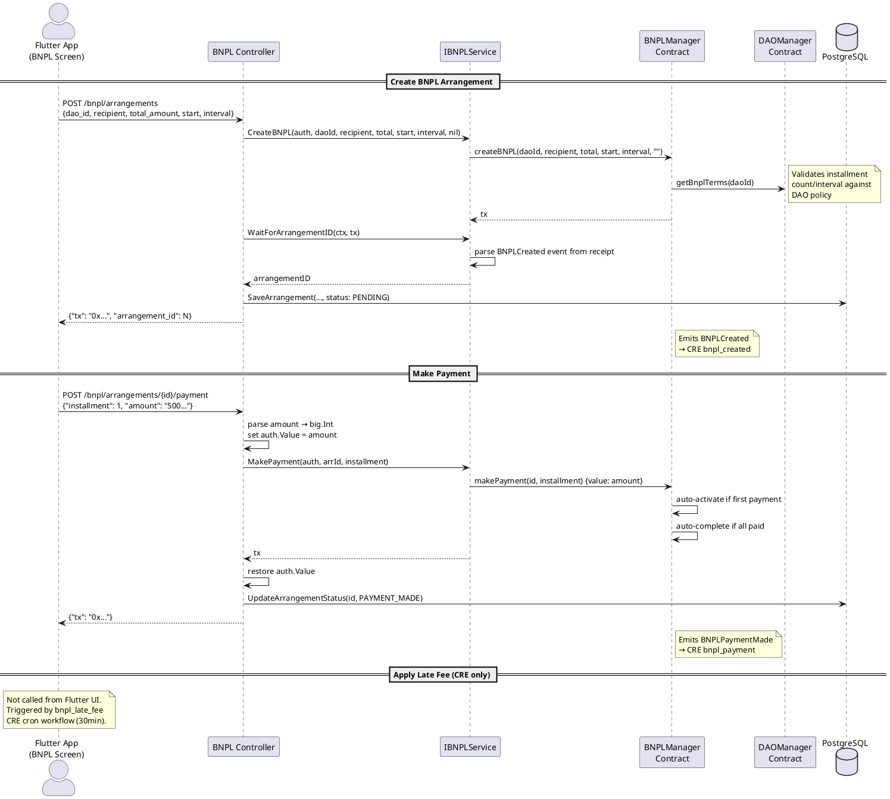

# BNPL Controller

**Source:** `protocol/controllers/bnpl/bnpl.go`  
**Mount:** `/bnpl` (protected — Privy JWT required)  
**Service:** `services/bnpl.IBNPLService`  
**Contract:** `BNPLManager` (`0x4d99Dc2e504c15496319339E822C4a8EAfe3e2ba`)

## Routes

| Method | Path                              | Handler           | Description                     |
|--------|-----------------------------------|-------------------|---------------------------------|
| POST   | `/bnpl/arrangements`              | `createArrangement`| Create a new BNPL arrangement   |
| GET    | `/bnpl/arrangements/{id}`         | `getArrangement`  | Get arrangement details         |
| POST   | `/bnpl/arrangements/{id}/payment` | `makePayment`     | Make an installment payment     |
| POST   | `/bnpl/arrangements/{id}/activate`| `activate`        | Manually activate an arrangement|
| POST   | `/bnpl/arrangements/{id}/latefee` | `applyLateFee`    | Apply late fee to an installment|
| POST   | `/bnpl/arrangements/{id}/reschedule`| `reschedule`    | Reschedule an arrangement       |

> **Note:** `activate` and `applyLateFee` routes exist in the backend but are **not exposed in the Flutter UI**. Activation is automatic (first payment), and late fees are applied exclusively by the `bnpl_late_fee` CRE cron workflow.

## Request / Response Schemas

### POST `/bnpl/arrangements` — Create Arrangement

**Request:**
```json
{
  "dao_id": "1",
  "recipient": "0x...",
  "total_amount": "1000000000000000000",
  "start_timestamp": 1700000000,
  "interval_seconds": 2592000
}
```
**Response:**
```json
{ "tx": "0x...", "arrangement_id": 1 }
```
**Side-effects:**
- Waits for receipt → parses `BNPLCreated` event → extracts arrangement ID
- Saves `Arrangement{arrangementID, daoId, payer, recipient, ...}` to PostgreSQL with status `PENDING`

---

### GET `/bnpl/arrangements/{id}` — Get Arrangement

**Response:** Full on-chain arrangement struct (from contract `getArrangement`)

---

### POST `/bnpl/arrangements/{id}/payment` — Make Payment

**Request:**
```json
{ "installment": 1, "amount": "500000000000000000" }
```
The `amount` field is parsed as a `big.Int` and set as the transaction's `msg.value` for the payable contract call. The controller saves the previous `auth.Value`, sets the new amount, calls `MakePayment`, then restores the original value.

**Response:**
```json
{ "tx": "0x..." }
```
**Side-effects:** Updates arrangement status to `PAYMENT_MADE` in PostgreSQL.  
**Note:** Contract auto-activates on first payment, auto-completes when all installments paid.

---

### POST `/bnpl/arrangements/{id}/activate` — Activate

**Response:**
```json
{ "tx": "0x..." }
```
**Side-effects:** Updates status to `ACTIVE`.  
**Note:** Not called by the Flutter app — activation is automatic on first payment.

---

### POST `/bnpl/arrangements/{id}/latefee` — Apply Late Fee

**Request:**
```json
{ "installment": 2 }
```
**Response:**
```json
{ "tx": "0x..." }
```
**Side-effects:** Updates status to `LATE_FEE_APPLIED`. Contract credits DAO treasury.  
**Note:** Not called by the Flutter app — handled by `bnpl_late_fee` CRE cron workflow.

---

### POST `/bnpl/arrangements/{id}/reschedule` — Reschedule

**Request:**
```json
{
  "new_start_timestamp": 1700100000,
  "new_interval_seconds": 3024000
}
```
**Response:**
```json
{ "tx": "0x..." }
```
**Side-effects:** Updates status to `RESCHEDULED`. Contract validates against DAO's BNPL terms.

## Data Flow Diagram


