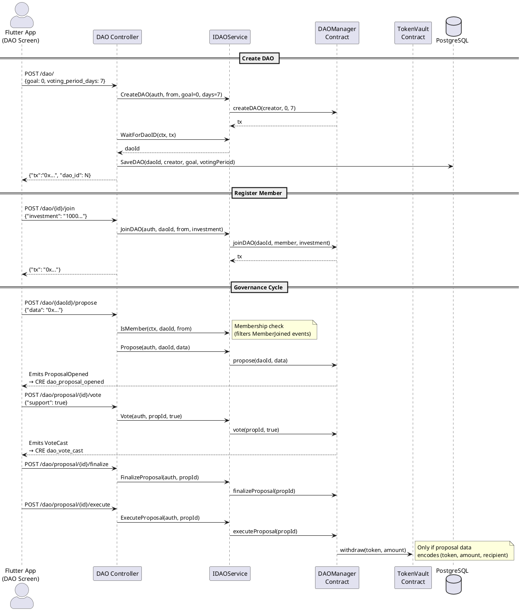

# DAO Controller

**Source:** `protocol/controllers/dao/dao.go`  
**Mount:** `/dao` (protected — Privy JWT required)  
**Service:** `services/dao.IDAOService`  
**Contract:** `DAOManager` (`0x561289A9B8439E3fb288a33b3c39C78E0923Cd2b`)

## Routes

| Method | Path                          | Handler           | Description                      |
|--------|-------------------------------|--------------------|----------------------------------|
| POST   | `/dao/`                       | `createDAO`        | Create a new DAO                 |
| POST   | `/dao/{id}/join`              | `joinDAO`          | Register member + investment     |
| POST   | `/dao/{daoId}/propose`        | `propose`          | Submit a governance proposal     |
| POST   | `/dao/proposal/{id}/vote`     | `vote`             | Cast a weighted vote             |
| POST   | `/dao/proposal/{id}/finalize` | `finalize`         | Finalize an expired proposal     |
| POST   | `/dao/proposal/{id}/execute`  | `execute`          | Execute an approved proposal     |
| POST   | `/dao/{id}/bnpl-terms`        | `setBnplTerms`     | Set BNPL policy for a DAO        |
| GET    | `/dao/{id}/bnpl-terms`        | `getBnplTerms`     | Get BNPL terms                   |
| GET    | `/dao/{id}/treasury`          | `getTreasuryBalance`| Get treasury balance            |
| POST   | `/dao/{id}/treasury/credit`   | `creditTreasury`   | Credit treasury                  |

## Request / Response Schemas

### POST `/dao/` — Create DAO

**Request:**
```json
{
  "goal": 0,
  "voting_period_days": 7
}
```
`goal` enum: 0=SAVINGS, 1=LENDING, 2=INVESTMENT

**Response:**
```json
{ "tx": "0x...", "dao_id": 1 }
```
**Side-effects:** Waits for `DaoCreated` event → extracts daoId. Saves DAO to PostgreSQL.

---

### POST `/dao/{id}/join` — Join DAO

**Request:**
```json
{ "investment": "1000000000000000000" }
```
**Response:**
```json
{ "tx": "0x..." }
```

---

### POST `/dao/{daoId}/propose` — Submit Proposal

**Request:**
```json
{ "data": "0xabcdef..." }
```
**Authorization:** Caller must be a DAO member (checked via `IsMember` which filters `MemberJoined` events).

**Response:**
```json
{ "tx": "0x..." }
```

---

### POST `/dao/proposal/{id}/vote` — Cast Vote

**Request:**
```json
{
  "dao_id": "1",
  "support": true
}
```
**Authorization:** Non-members cannot vote (checked if `dao_id` provided).

**Response:**
```json
{ "tx": "0x..." }
```

---

### POST `/dao/proposal/{id}/finalize` — Finalize Proposal

**Response:**
```json
{ "tx": "0x..." }
```
**Note:** Contract requires proposal to be past its expiry.

---

### POST `/dao/proposal/{id}/execute` — Execute Proposal

**Response:**
```json
{ "tx": "0x..." }
```
**Note:** If proposal data is 96 bytes, decoded as `(token, amount, recipient)` → withdraws from TokenVault.

---

### POST `/dao/{id}/bnpl-terms` — Set BNPL Terms

**Request:**
```json
{
  "num_installments": "6",
  "min_days": "7",
  "max_days": "30",
  "late_fee_bps": "500",
  "grace_days": "3",
  "reschedule_allowed": true,
  "min_down_bps": "1000"
}
```
**Response:**
```json
{ "tx": "0x..." }
```

---

### GET `/dao/{id}/bnpl-terms` — Get BNPL Terms

**Response:** Full 7-field BnplTerms struct from contract.

---

### GET `/dao/{id}/treasury` — Get Treasury Balance

**Response:**
```json
{ "balance": "50000000000000000000" }
```

---

### POST `/dao/{id}/treasury/credit` — Credit Treasury

**Request:**
```json
{ "amount": "1000000000000000000" }
```
**Response:**
```json
{ "tx": "0x..." }
```

## Data Flow Diagram


