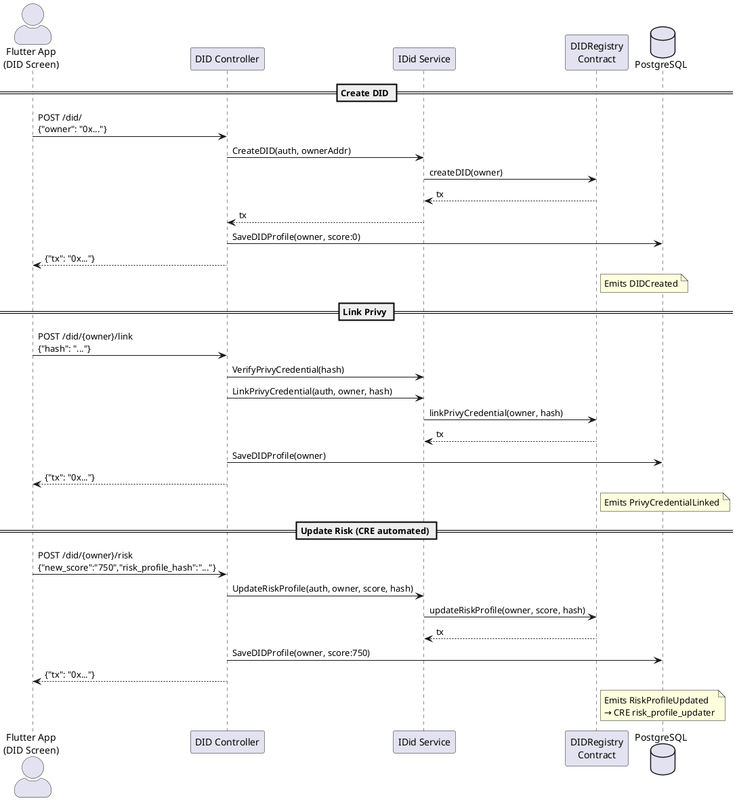

# DID Controller

**Source:** `protocol/controllers/did/did.go`  
**Mount:** `/did` (protected — Privy JWT required)  
**Service:** `services/did.IDid`  
**Contract:** `DIDRegistry` (`0x0E9D8959bCD99e7AFD7C693e51781058A998b756`)

## Routes

| Method | Path               | Handler               | Description                    |
|--------|--------------------|-----------------------|--------------------------------|
| POST   | `/did/`            | `createDID`           | Create a new DID on-chain      |
| GET    | `/did/{owner}`     | `lookupDID`           | Check if DID exists            |
| POST   | `/did/{owner}/link`| `linkPrivy`           | Link Privy credential hash     |
| GET    | `/did/{owner}/privy`| `getPrivyHash`       | Get linked Privy credential    |
| POST   | `/did/{owner}/risk`| `updateRiskProfile`   | Update risk score + hash       |
| GET    | `/did/{owner}/risk`| `getRiskProfileScore` | Get current risk score         |

## Request / Response Schemas

### POST `/did/` — Create DID

**Request:**
```json
{ "owner": "0x..." }
```
**Response:**
```json
{ "tx": "0x..." }
```
**Side-effects:** Saves `DIDProfile{owner, riskScore: 0}` to PostgreSQL.

---

### GET `/did/{owner}` — Lookup DID

**Response:**
```json
{ "exists": true }
```

---

### POST `/did/{owner}/link` — Link Privy Credential

**Request:**
```json
{ "hash": "abcdef1234..." }
```
**Response:**
```json
{ "tx": "0x..." }
```
**Validation:** Calls `svc.VerifyPrivyCredential(hash)` before submitting tx.

---

### GET `/did/{owner}/privy` — Get Privy Hash

**Response:**
```json
{ "hash": "abcdef1234..." }
```

---

### POST `/did/{owner}/risk` — Update Risk Profile

**Request:**
```json
{
  "new_score": "750",
  "risk_profile_hash": "abcdef1234..."
}
```
**Response:**
```json
{ "tx": "0x..." }
```
**Side-effects:** Updates `DIDProfile.riskScore` in PostgreSQL.

---

### GET `/did/{owner}/risk` — Get Risk Score

**Response:**
```json
{ "risk_score": "750" }
```

## Data Flow Diagram


