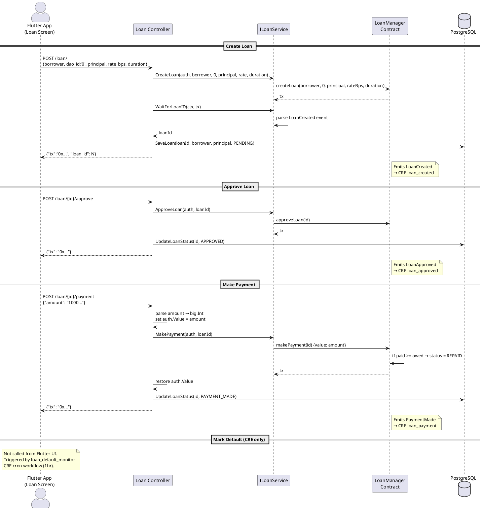

# Loan Controller

**Source:** `protocol/controllers/loan/loan.go`  
**Mount:** `/loan` (protected — Privy JWT required)  
**Service:** `services/loan.ILoanService`  
**Contract:** `LoanManager` (`0xbB0D4067488edf4a007822407e2486412dC8D39D`)

## Routes

| Method | Path                  | Handler              | Description                    |
|--------|-----------------------|----------------------|--------------------------------|
| POST   | `/loan/`              | `createLoan`         | Create a new loan              |
| POST   | `/loan/{id}/approve`  | `approveLoan`        | Approve a pending loan         |
| POST   | `/loan/{id}/payment`  | `makePayment`        | Make a loan payment            |
| POST   | `/loan/{id}/default`  | `markDefaulted`      | Mark a loan as defaulted       |
| GET    | `/loan/{id}`          | `getLoan`            | Get loan details               |
| GET    | `/loan/{id}/interest` | `getAccruedInterest` | Get current accrued interest   |
| GET    | `/loan/{id}/owed`     | `getAmountOwed`      | Get total amount owed          |

> **Note:** `markDefaulted` route exists in the backend but is **not exposed in the Flutter UI**. Loan defaults are handled exclusively by the `loan_default_monitor` CRE cron workflow.

## Request / Response Schemas

### POST `/loan/` — Create Loan

**Request:**
```json
{
  "borrower": "0x...",
  "dao_id": "0",
  "principal": "5000000000000000000",
  "interest_rate_bps": "500",
  "duration_seconds": "2592000"
}
```
The `dao_id` field is passed to the contract but is not used in storage (reserved for future DAO-linked features). The Flutter app hardcodes it to `"0"`.

**Response:**
```json
{ "tx": "0x...", "loan_id": 1 }
```
**Side-effects:**
- Waits for receipt → parses `LoanCreated` event → extracts loanId
- Saves `Loan{loanId, borrower, daoAddress, principal, rateBps}` to PostgreSQL with status `PENDING`

---

### POST `/loan/{id}/approve` — Approve Loan

**Response:**
```json
{ "tx": "0x..." }
```
**Side-effects:** Updates loan status to `APPROVED` in PostgreSQL.

---

### POST `/loan/{id}/payment` — Make Payment

**Request:**
```json
{ "amount": "1000000000000000000" }
```
The `amount` field is parsed as a `big.Int` and set as the transaction's `msg.value` for the payable contract call. The controller saves the previous `auth.Value`, sets the new amount, calls `MakePayment`, then restores the original value.

**Response:**
```json
{ "tx": "0x..." }
```
**Side-effects:** Updates loan status to `PAYMENT_MADE`. Contract auto-marks as `REPAID` when payment >= owed.

---

### POST `/loan/{id}/default` — Mark Defaulted

**Response:**
```json
{ "tx": "0x..." }
```
**Side-effects:** Updates loan status to `DEFAULTED`.  
**Note:** Not called from the Flutter app — handled by `loan_default_monitor` CRE cron workflow.

---

### GET `/loan/{id}` — Get Loan Details

**Response:** Full on-chain loan struct from contract.

---

### GET `/loan/{id}/interest` — Get Accrued Interest

**Response:**
```json
{ "accrued_interest": "25000000000000000" }
```
**Formula:** `(principal × rateBps × elapsed) / (10000 × 365 days)`

---

### GET `/loan/{id}/owed` — Get Amount Owed

**Response:**
```json
{ "amount_owed": "5025000000000000000" }
```

## Data Flow Diagram


