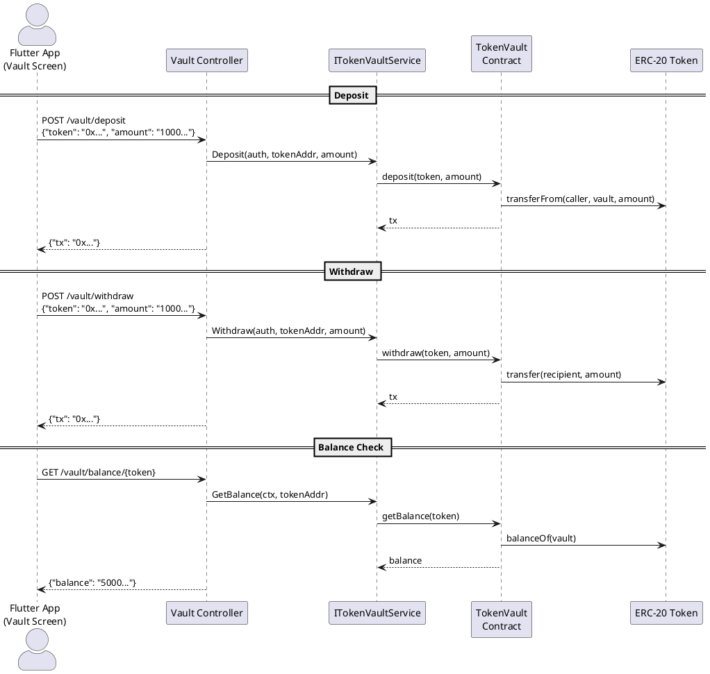

# TokenVault Controller

**Source:** `protocol/controllers/tokenvault/tokenvault.go`  
**Mount:** `/vault` (protected — Privy JWT required)  
**Service:** `services/tokenvault.ITokenVaultService`  
**Contract:** `TokenVault` (`0x4C704D51fc47cfe582F8c5477de3AE398B344907`)

## Routes

| Method | Path                  | Handler      | Description              |
|--------|-----------------------|-------------|--------------------------|
| POST   | `/vault/deposit`      | `deposit`    | Deposit ERC-20 tokens    |
| POST   | `/vault/withdraw`     | `withdraw`   | Withdraw ERC-20 tokens   |
| GET    | `/vault/balance/{token}` | `getBalance` | Get token balance      |

## Request / Response Schemas

### POST `/vault/deposit` — Deposit Tokens

**Request:**
```json
{
  "token": "0x...",
  "amount": "1000000000000000000"
}
```
**Response:**
```json
{ "tx": "0x..." }
```
**Note:** Requires prior ERC-20 approval from caller to vault contract.

---

### POST `/vault/withdraw` — Withdraw Tokens

**Request:**
```json
{
  "token": "0x...",
  "amount": "1000000000000000000"
}
```
**Response:**
```json
{ "tx": "0x..." }
```
**Note:** Caller must have `ADMIN` or `VAULT_MANAGER_ROLE` on the contract.

---

### GET `/vault/balance/{token}` — Get Balance

**Response:**
```json
{ "balance": "5000000000000000000" }
```

## Data Flow Diagram



## No Off-Chain Storage

Unlike other controllers, TokenVault does **not** use the PostgreSQL store — all state is on-chain.
