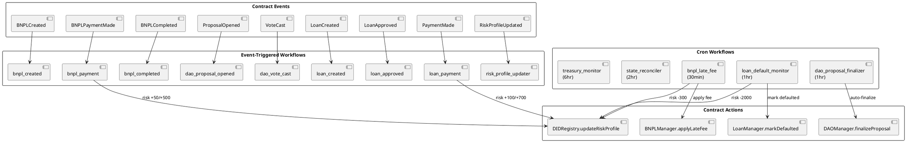

# CRE Workflows

**Source:** `workflows/`  
**Runtime:** Chainlink CRE (Compute Runtime Environment) — WASM  
**SDK:** `github.com/smartcontractkit/cre-sdk-go v1.1.0`  
**Chain:** Ethereum Testnet Sepolia (chain 11155111)  
**Build:** `GOOS=wasip1 GOARCH=wasm go build ./...`

## Architecture Overview

All 14 workflows share a common `shared.Config` struct and utility package. They run as WASM binaries on the CRE DON (Decentralized Oracle Network) and interact with on-chain contracts via the CRE EVM client.

```
┌──────────────────────────────────────────────────────────┐
│                   CRE DON Runtime                         │
│                                                          │
│  ┌─────────────────────┐  ┌────────────────────────────┐ │
│  │  Event-Triggered (10)│  │   Cron-Triggered (4)       │ │
│  │                     │  │                            │ │
│  │  bnpl_created       │  │  bnpl_late_fee   (30min)   │ │
│  │  bnpl_payment       │  │  dao_proposal_   (1hr)     │ │
│  │  bnpl_completed     │  │    finalizer               │ │
│  │  dao_proposal_opened│  │  loan_default_   (1hr)     │ │
│  │  dao_vote_cast      │  │    monitor                 │ │
│  │  loan_created       │  │  state_reconciler(2hr)     │ │
│  │  loan_approved      │  │  treasury_monitor(6hr)     │ │
│  │  loan_payment       │  │                            │ │
│  │  risk_profile_updater│  │                            │ │
│  └─────────┬───────────┘  └──────────┬─────────────────┘ │
│            │                         │                    │
│            ▼                         ▼                    │
│  ┌─────────────────────────────────────────────────────┐  │
│  │              shared/config.go  +  helpers            │  │
│  └──────────┬──────────────────────────┬───────────────┘  │
└─────────────┼──────────────────────────┼──────────────────┘
              │                          │
     ┌────────▼────────┐       ┌────────▼────────┐
     │  Sepolia RPC     │       │  Backend API    │
     │  (EVM read/write)│       │  (Confidential  │
     │                  │       │   HTTP)          │
     └──────────────────┘       └─────────────────┘
```

## Workflow Summary Table

| # | Workflow | Trigger | Event/Schedule | Contract Read | Contract Write | Risk Adjust | Backend Notify |
|---|---------|---------|----------------|---------------|----------------|-------------|----------------|
| 1 | `bnpl_created` | EVM Log | `BNPLCreated` | getArrangement, getBnplTerms | — | — | /api/bnpl/created |
| 2 | `bnpl_payment` | EVM Log | `BNPLPaymentMade` | getArrangement, getRiskProfileScore | updateRiskProfile | +50 / +500 (final) | /api/bnpl/payment |
| 3 | `bnpl_completed` | EVM Log | `BNPLCompleted` | getArrangement, getTreasuryBalance | — | — | /api/bnpl/completed |
| 4 | `bnpl_late_fee` | Cron (30m) | — | getArrangement, getBnplTerms, getRiskProfileScore | applyLateFee, updateRiskProfile | -300 | — |
| 5 | `dao_proposal_opened` | EVM Log | `ProposalOpened` | — | — | — | /api/dao/proposals/opened |
| 6 | `dao_vote_cast` | EVM Log | `VoteCast` | — | — | — | /api/dao/votes |
| 7 | `dao_proposal_finalizer` | Cron (1hr) | — | — | finalizeProposal | — | /api/dao/proposals/{id}/finalized |
| 8 | `loan_created` | EVM Log | `LoanCreated` | getRiskProfileScore | — | — | /api/loans/created |
| 9 | `loan_approved` | EVM Log | `LoanApproved` | getLoan, getAmountOwed, getAccruedInterest | — | — | /api/loans/approved |
| 10 | `loan_payment` | EVM Log | `PaymentMade` | getRiskProfileScore, getAccruedInterest | updateRiskProfile | +100 / +700 (payoff) | /api/loans/payment |
| 11 | `loan_default_monitor` | Cron (1hr) | — | getLoan, getAmountOwed, getRiskProfileScore | markDefaulted, updateRiskProfile | -2000 | /api/loans/{id}/defaulted |
| 12 | `risk_profile_updater` | EVM Log | `RiskProfileUpdated` | — | — | — | /api/did/risk-updated, /api/did/tier-changed |
| 13 | `state_reconciler` | Cron (2hr) | — | getArrangement, getLoan, getAmountOwed, getTreasuryBalance | — | — | /api/reconcile/* |
| 14 | `treasury_monitor` | Cron (6hr) | — | getBalance, getTreasuryBalance | — | — | /api/treasury/alert |

## Risk Score Adjustments

| Event | Delta | Reason | Workflow |
|-------|-------|--------|----------|
| BNPL payment on-time | +50 | `bnpl_payment` | `bnpl_payment` |
| BNPL completed on-time (final payment) | +500 | `bnpl_final_payment` | `bnpl_payment` |
| BNPL late fee applied | -300 | `bnpl_late_fee` | `bnpl_late_fee` |
| Loan payment on-time | +100 | `loan_payment` | `loan_payment` |
| Loan fully repaid | +700 | `loan_payoff` | `loan_payment` |
| Loan defaulted | -2000 | `loan_defaulted` | `loan_default_monitor` |

## Shared Configuration

All workflows use `shared.Config` (see `shared/config.go`):

```json
{
  "owner": "",
  "chainSelector": "ethereum-testnet-sepolia",
  "schedule": "0 */30 * * * *",
  "bnplManagerAddress": "0x4d99Dc2e504c15496319339E822C4a8EAfe3e2ba",
  "loanManagerAddress": "0xbB0D4067488edf4a007822407e2486412dC8D39D",
  "daoManagerAddress": "0x561289A9B8439E3fb288a33b3c39C78E0923Cd2b",
  "didRegistryAddress": "0x0E9D8959bCD99e7AFD7C693e51781058A998b756",
  "tokenVaultAddress": "0x4C704D51fc47cfe582F8c5477de3AE398B344907",
  "backendUrl": "http://13.60.166.148:8000",
  "gracePeriodSeconds": 259200,
  "treasuryAlertThresholdWei": "1000000000000000000"
}
```

## Detailed Workflow Documentation

- [bnpl_created](bnpl_created.md)
- [bnpl_payment](bnpl_payment.md)
- [bnpl_completed](bnpl_completed.md)
- [bnpl_late_fee](bnpl_late_fee.md)
- [dao_proposal_opened](dao_proposal_opened.md)
- [dao_vote_cast](dao_vote_cast.md)
- [dao_proposal_finalizer](dao_proposal_finalizer.md)
- [loan_created](loan_created.md)
- [loan_approved](loan_approved.md)
- [loan_payment](loan_payment.md)
- [loan_default_monitor](loan_default_monitor.md)
- [risk_profile_updater](risk_profile_updater.md)
- [state_reconciler](state_reconciler.md)
- [treasury_monitor](treasury_monitor.md)

## Event → Workflow Mapping Diagram


