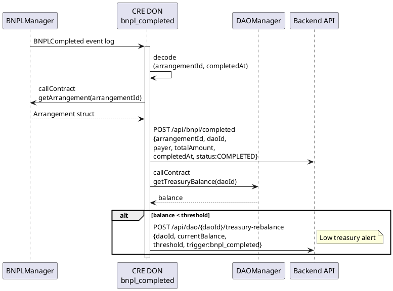

# bnpl_completed Workflow

**Source:** `workflows/bnpl_completed/main.go`  
**Trigger:** EVM Log — `BNPLCompleted(uint256 indexed arrangementId, uint256 completedAt)`  
**Contracts:** BNPLManager, DAOManager

## Purpose

When a BNPL arrangement is marked completed on-chain, this workflow:
1. Reads the full arrangement state for final reporting
2. Notifies the backend of completion
3. Reads the DAO treasury balance
4. Triggers a treasury rebalance check if balance falls below threshold

## Flow

