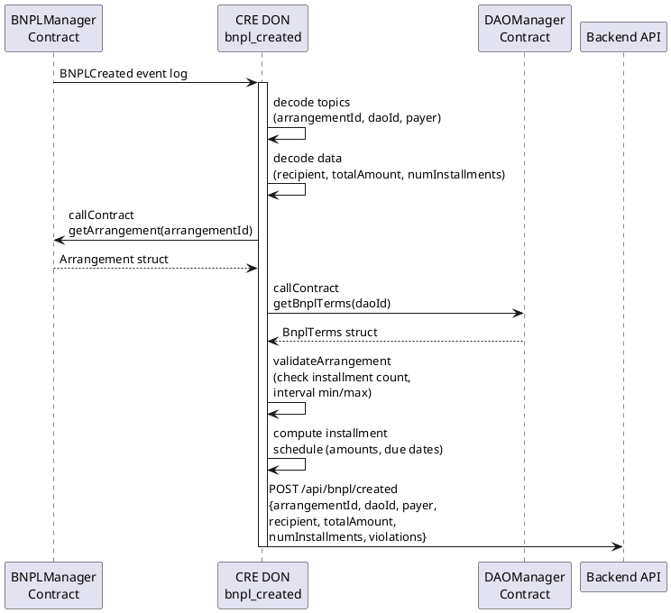

# bnpl_created Workflow

**Source:** `workflows/bnpl_created/main.go`  
**Trigger:** EVM Log — `BNPLCreated(uint256 indexed arrangementId, uint256 indexed daoId, address indexed payer, address recipient, uint256 totalAmount, uint256 numInstallments)`  
**Contract:** BNPLManager

## Purpose

When a new BNPL arrangement is created on-chain, this workflow:
1. Reads the full arrangement state from BNPLManager
2. Reads the DAO's BNPL terms for policy validation
3. Validates arrangement parameters against DAO policy
4. Computes the installment schedule
5. Notifies the backend via confidential HTTP

## Flow

## Policy Validation

The workflow checks the arrangement against the DAO's BNPL terms:

| Check | Rule |
|-------|------|
| Installment count | Must match `terms.NumInstallments` (if set) |
| Interval min | `intervalDays >= terms.AllowedIntervalMinDays` |
| Interval max | `intervalDays <= terms.AllowedIntervalMaxDays` |

Violations are logged as warnings and reported to the backend.
