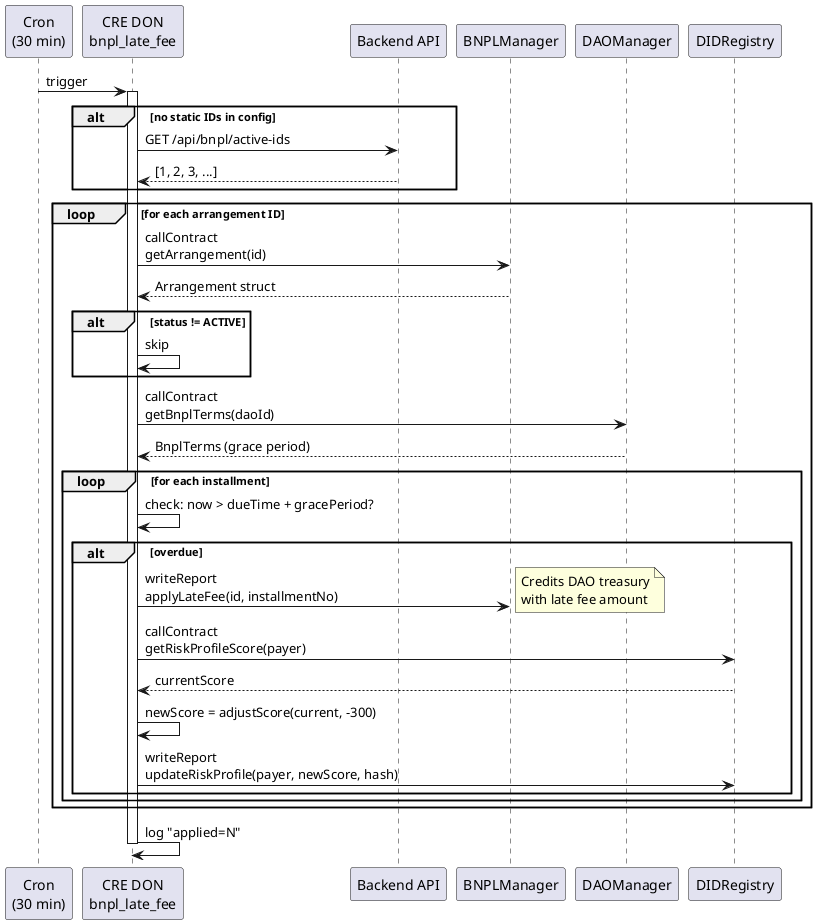

# bnpl_late_fee Workflow

**Source:** `workflows/bnpl_late_fee/main.go`  
**Trigger:** Cron — every 30 minutes  
**Contracts:** BNPLManager, DAOManager, DIDRegistry

## Purpose

Scans active BNPL arrangements for overdue installments past the grace period. For each overdue installment:
1. Calls `BNPLManager.applyLateFee` on-chain (credits DAO treasury)
2. Reads the payer's risk score and applies -300 penalty
3. Writes updated risk profile on-chain

## Risk Adjustments

| Condition | Delta | Reason |
|-----------|-------|--------|
| Late fee applied per installment | -300 | `bnpl_late_fee` |

## Flow

