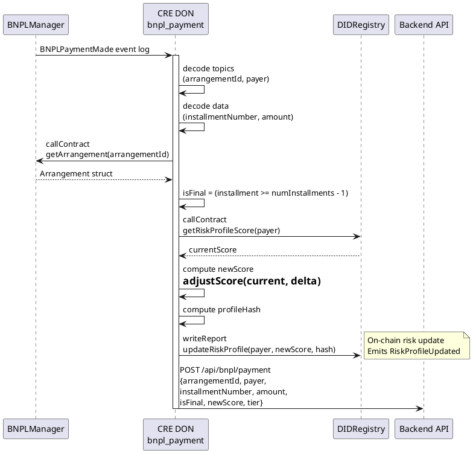

# bnpl_payment Workflow

**Source:** `workflows/bnpl_payment/main.go`  
**Trigger:** EVM Log — `BNPLPaymentMade(uint256 indexed arrangementId, address indexed payer, uint8 installmentNumber, uint256 amount)`  
**Contracts:** BNPLManager, DIDRegistry

## Purpose

When a BNPL installment payment is made on-chain, this workflow:
1. Decodes payment details from the event
2. Reads the full arrangement to check if this is the final payment
3. Reads the payer's current DID risk score
4. Adjusts risk score upward (+50 per payment, +500 if final)
5. Writes the updated risk profile on-chain
6. Notifies the backend

## Risk Adjustments

| Condition | Delta | Reason |
|-----------|-------|--------|
| Regular payment | +50 | `bnpl_payment` |
| Final payment (completes arrangement) | +500 | `bnpl_final_payment` |

## Flow

