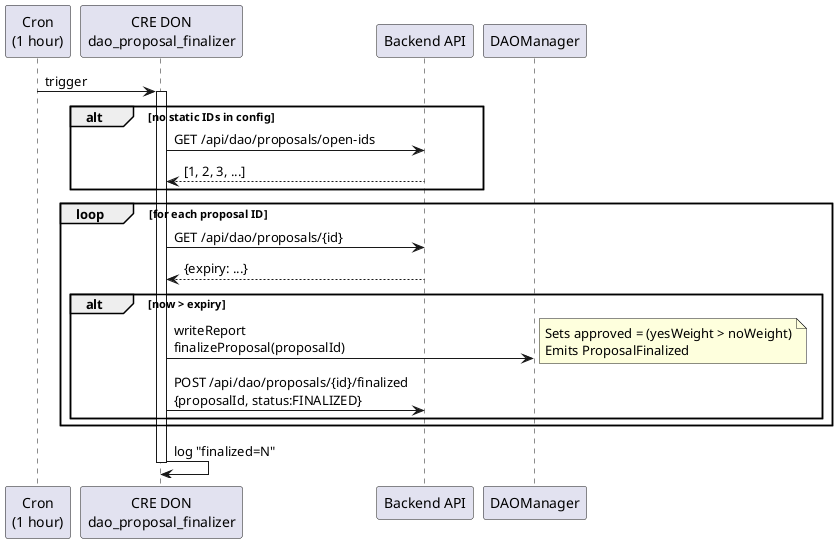

# dao_proposal_finalizer Workflow

**Source:** `workflows/dao_proposal_finalizer/main.go`  
**Trigger:** Cron — every hour  
**Contract:** DAOManager

## Purpose

Scans open DAO proposals and finalizes any that have passed their expiry timestamp by calling `DAOManager.finalizeProposal` on-chain.

## Flow

