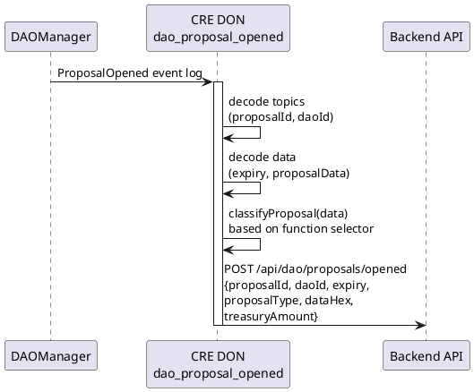

# dao_proposal_opened Workflow

**Source:** `workflows/dao_proposal_opened/main.go`  
**Trigger:** EVM Log — `ProposalOpened(uint256 indexed proposalId, uint256 indexed daoId, uint256 expiry, bytes data)`  
**Contract:** DAOManager

## Purpose

When a new DAO proposal is opened on-chain, this workflow:
1. Decodes the proposal event with expiry and attached data
2. Classifies the proposal by inspecting the data payload (TREASURY_TRANSFER, TREASURY_APPROVE, CUSTOM, GENERIC)
3. Notifies the backend with full proposal details

## Proposal Classification

| Selector (first 4 bytes) | Type |
|---------------------------|------|
| `a9059cbb` (transfer) | `TREASURY_TRANSFER` |
| `095ea7b3` (approve) | `TREASURY_APPROVE` |
| `23b872dd` (transferFrom) | `TREASURY_TRANSFER_FROM` |
| Other 4+ bytes | `CUSTOM` |
| < 4 bytes | `GENERIC` |

## Flow

