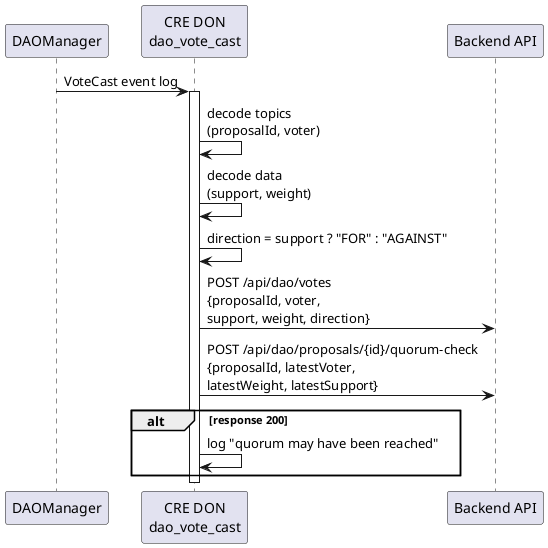

# dao_vote_cast Workflow

**Source:** `workflows/dao_vote_cast/main.go`  
**Trigger:** EVM Log — `VoteCast(uint256 indexed proposalId, address indexed voter, bool support, uint256 weight)`  
**Contract:** DAOManager

## Purpose

When a vote is cast on a DAO proposal:
1. Decodes vote details (direction, weight)
2. Notifies the backend of the individual vote
3. Sends a quorum-check request to the backend (backend tracks cumulative votes)

## Flow

