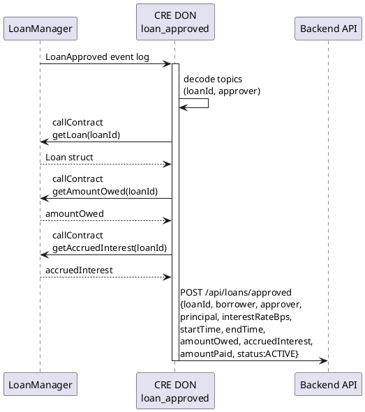

# loan_approved Workflow

**Source:** `workflows/loan_approved/main.go`  
**Trigger:** EVM Log — `LoanApproved(uint256 indexed loanId, address indexed approver)`  
**Contract:** LoanManager

## Purpose

When a loan is approved on-chain:
1. Reads full loan state (principal, rates, terms)
2. Reads current amount owed and accrued interest
3. Assembles a comprehensive loan snapshot
4. Notifies the backend with the full snapshot

## Flow

