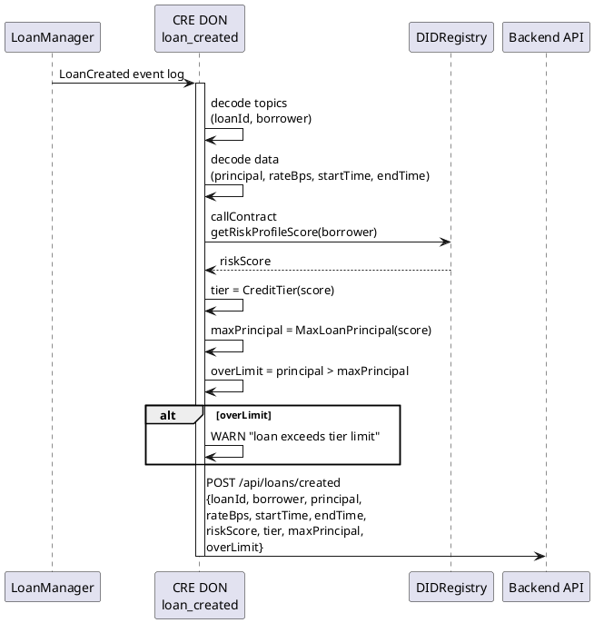

# loan_created Workflow

**Source:** `workflows/loan_created/main.go`  
**Trigger:** EVM Log — `LoanCreated(uint256 indexed loanId, address indexed borrower, uint256 principal, uint256 interestRateBps, uint256 startTime, uint256 endTime)`  
**Contracts:** LoanManager, DIDRegistry

## Purpose

When a new loan is created on-chain:
1. Decodes the loan creation event data
2. Reads the borrower's DID risk score to assess eligibility
3. Computes max allowed principal for the borrower's credit tier
4. Flags over-limit loans for review
5. Notifies the backend with risk assessment

## Credit Tier System

| Tier | Score Range | Max Loan Principal |
|------|-------------|-------------------|
| EXCELLENT | ≥ 800 | Computed by `MaxLoanPrincipal()` |
| GOOD | ≥ 600 | Lower |
| FAIR | ≥ 400 | Lower |
| POOR | < 400 | Lowest |

## Flow

