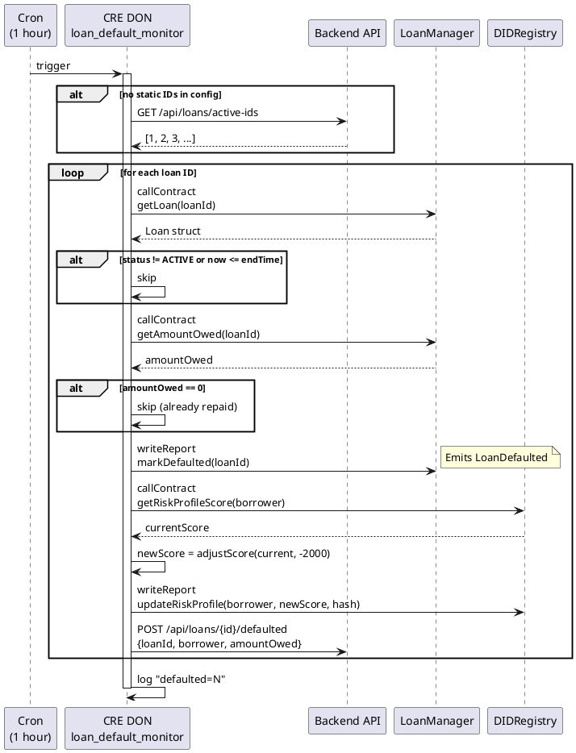

# loan_default_monitor Workflow

**Source:** `workflows/loan_default_monitor/main.go`  
**Trigger:** Cron — every hour  
**Contracts:** LoanManager, DIDRegistry

## Purpose

Scans active loans past their end time. For each defaultable loan:
1. Verifies outstanding balance > 0 via `getAmountOwed`
2. Calls `LoanManager.markDefaulted` on-chain
3. Slashes the borrower's DID risk score (-2000)
4. Notifies the backend

## Risk Adjustments

| Condition | Delta | Reason |
|-----------|-------|--------|
| Loan defaulted | -2000 | `loan_defaulted` |

## Flow

