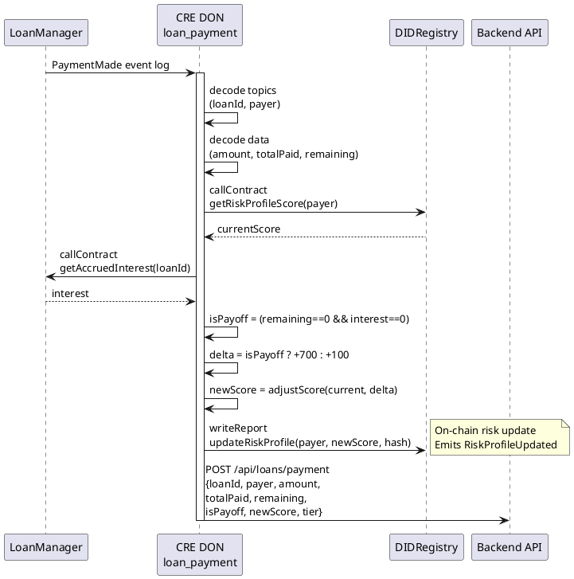

# loan_payment Workflow

**Source:** `workflows/loan_payment/main.go`  
**Trigger:** EVM Log — `PaymentMade(uint256 indexed loanId, address indexed payer, uint256 amount, uint256 amountPaid, uint256 remaining)`  
**Contracts:** LoanManager, DIDRegistry

## Purpose

When a loan payment is made on-chain:
1. Decodes payment event data
2. Reads borrower's current risk score
3. Checks remaining interest to determine if loan is fully repaid
4. Adjusts risk score upward
5. Writes updated risk profile on-chain
6. Notifies the backend

## Risk Adjustments

| Condition | Delta | Reason |
|-----------|-------|--------|
| Regular payment | +100 | `loan_payment` |
| Full repayment (remaining=0, interest=0) | +700 | `loan_payoff` |

## Flow

