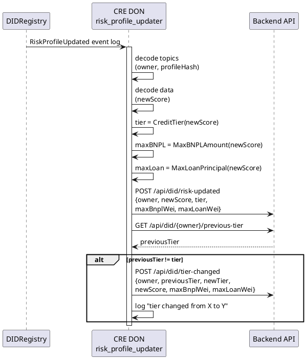

# risk_profile_updater Workflow

**Source:** `workflows/risk_profile_updater/main.go`  
**Trigger:** EVM Log — `RiskProfileUpdated(address indexed owner, uint256 newScore, bytes32 indexed profileHash)`  
**Contract:** DIDRegistry

## Purpose

When a risk profile is updated on-chain (by any of the other workflows):
1. Decodes the new score from the event
2. Computes credit tier, max BNPL amount, max loan principal
3. Reads the previous tier from the backend to detect tier transitions
4. Notifies the backend of the update and any tier change

## Credit Tiers

| Tier | Score Range |
|------|-------------|
| EXCELLENT | ≥ 800 |
| GOOD | ≥ 600 |
| FAIR | ≥ 400 |
| POOR | < 400 |

## Flow

