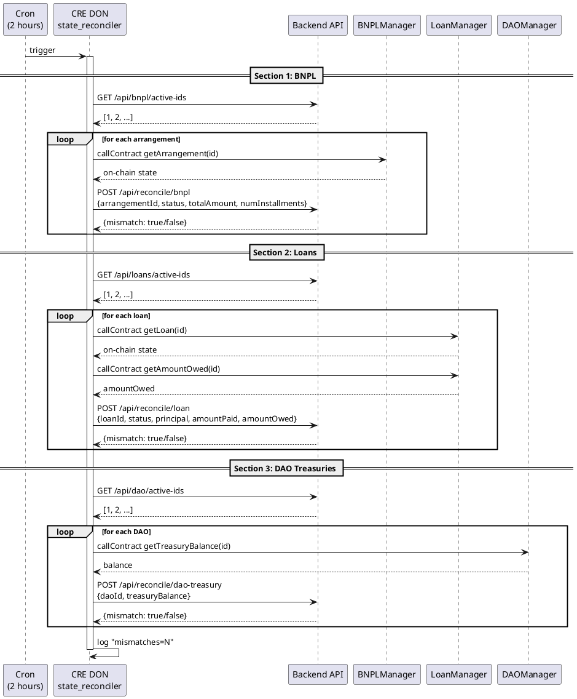

# state_reconciler Workflow

**Source:** `workflows/state_reconciler/main.go`  
**Trigger:** Cron — every 2 hours  
**Contracts:** BNPLManager, LoanManager, DAOManager

## Purpose

Cross-checks on-chain state with the backend database for all active entities. Reports mismatches for reconciliation.

## Reconciliation Sections

1. **BNPL Arrangements** — reads on-chain status/amounts, sends to `/api/reconcile/bnpl`
2. **Loans** — reads on-chain loan state + amount owed, sends to `/api/reconcile/loan`
3. **DAO Treasuries** — reads on-chain treasury balances, sends to `/api/reconcile/dao-treasury`

## Flow

