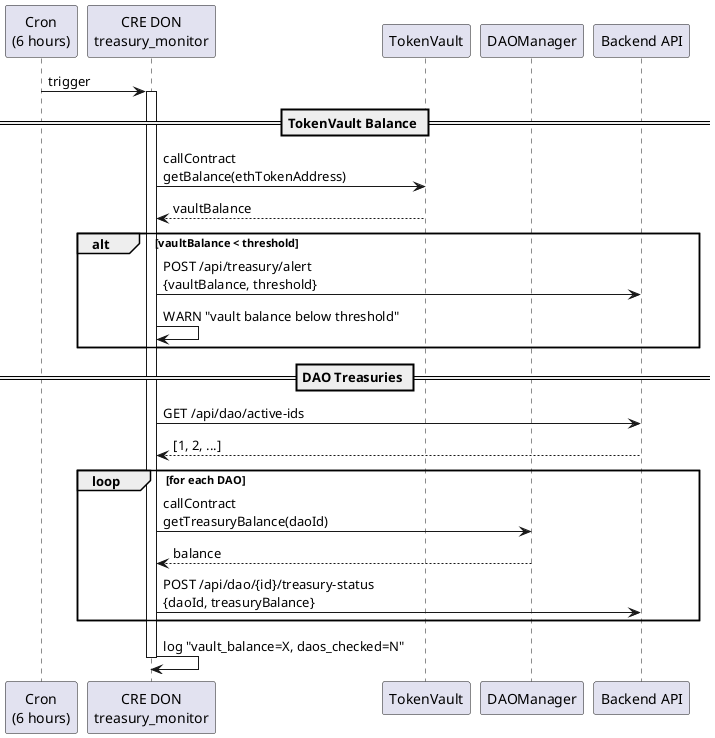

# treasury_monitor Workflow

**Source:** `workflows/treasury_monitor/main.go`  
**Trigger:** Cron — every 6 hours  
**Contracts:** TokenVault, DAOManager

## Purpose

Monitors the TokenVault ETH balance and each DAO treasury balance. Alerts the backend when the vault balance drops below a configured threshold.

## Flow

